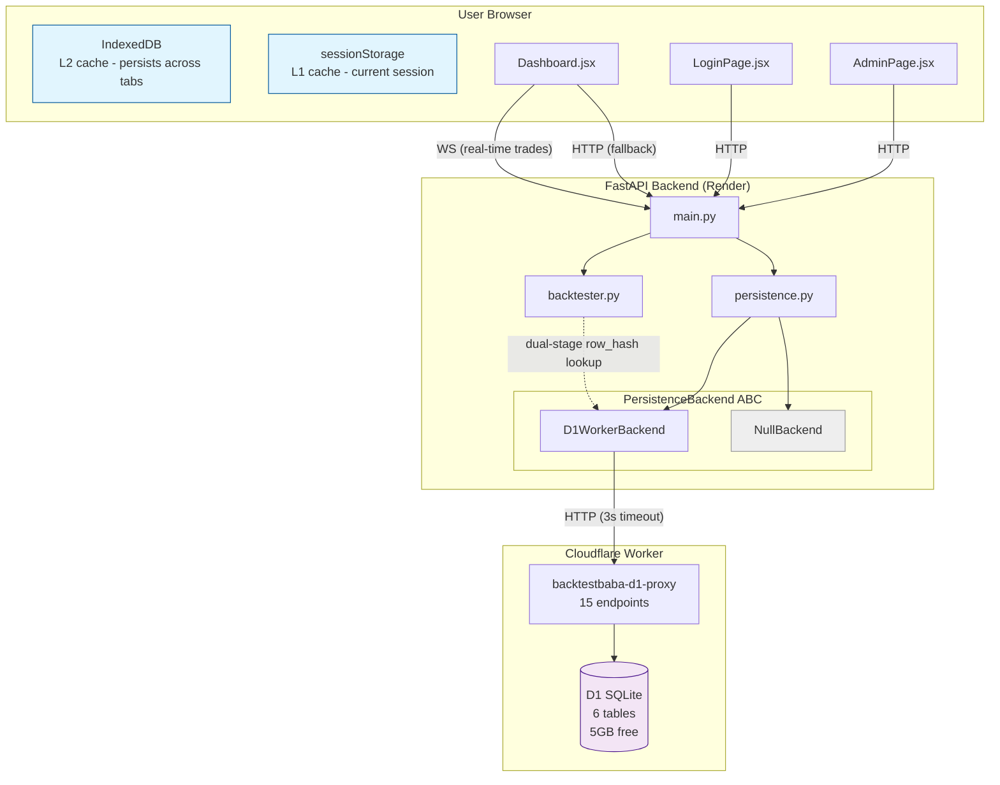
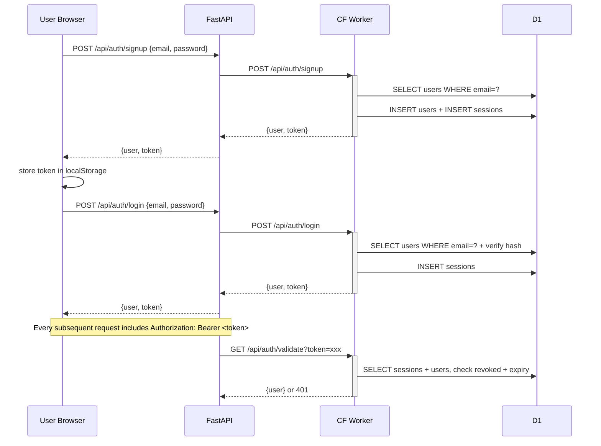

# Architecture: D1 Persistence Microservice

## System Context

BacktestBaba is a stateless CSV backtesting app. Users upload signals (symbol + date pairs), the backend fetches prices, computes returns across 6 horizons (7/14/30/45/60/90d), and streams results via WebSocket. Currently, results live only in `sessionStorage` — gone on tab close.

The D1 Persistence Microservice adds a durable, queryable, zero-cost data layer with user identity, priority tiers, immediate audit logging, and dual-stage yfinance filtering.

### Worker Deployment Status (as of July 2026)

| Component | Status | Notes |
|---|---|---|
| Worker URL | ✅ Live | `https://backtestbaba-d1-proxy.rockywithstocky-ff8.workers.dev` |
| D1 database `backtestbaba` | ✅ Created | Free tier, 5GB |
| D1 binding to Worker | ❌ Not configured | Must be done before Phase D |
| API endpoints (15 routes) | ❌ Not deployed | Default Hello World template |
| Schema (6 tables) | ❌ Not applied | Migration in Phase C |

---

## Architecture Diagram



---

## Data Flow — Full Lifecycle

```mermaid
sequenceDiagram
    participant U as User Browser
    participant F as FastAPI
    participant C as diskcache
    participant W as CF Worker
    participant D as D1
    participant Y as yfinance

    U->>F: WebSocket: upload CSV bytes
    F->>F: SHA-256 file hash
    F->>+W: POST /api/ingestion (Pillar 3 — immediate log)
    W->>D: INSERT ingestion_log (status='received')
    W-->>-F: {id: "..."}
    F->>C: FileHashCache.get(hash)
    alt Cache HIT
        C-->>F: cached report
        F-->>U: stream cached trades via WS
    else Cache MISS
        F->>F: parse CSV → signals
        F->>F: compute row_hashes from inputs
        F->>+W: POST /api/signals/lookup (Pillar 4 — dual-stage)
        W->>D: SELECT row_hash WHERE row_hash IN (...)
        W-->>-F: {existing: ["hash1", "hash2"]}
        F->>F: split: known_set → skip; new_set → process
        F->>+Y: yf.download(new_set symbols only)
        Y-->>-F: OHLCV data
        F->>F: run_backtest_async() — compute returns
        F-->>U: progress + trades via WS
        F->>C: FileHashCache.set(hash, report)
        F-->>U: {"type": "complete", report}
        U->>U: save to IndexedDB (Pillar 4 — client-mediated)
        U->>U: background POST to /api/persist (1s→2s→4s→8s retry)
        Note over F: synchronous D1 persist (before WS complete)
        F->>W: POST /api/uploads + POST /api/signals
        W->>D: INSERT OR IGNORE signal_hashes
        W->>D: UPDATE quota
    end
```

---

## Auth Flow



---

## Graceful Degradation Matrix

| Scenario | Detection | Backend Behavior | User Experience |
|---|---|---|---|
| PERSISTENCE_ENABLED=False | Config flag | NullBackend, no-op | Normal report, no badge |
| Worker unreachable | HTTP timeout (>3s) | Log warning, skip persist | Normal report |
| Worker 429 (quota ≥95%) | HTTP 429 response | Log warning, skip persist | Normal report |
| Worker 500 on ingestion | HTTP 500 | Log error, skip persist, backtest still runs | Normal report |
| D1 lookup fails (dual-stage, Phase E) | Timeout on POST /signals/lookup | Log warning, fetch ALL from yfinance (no optimization) | Normal report, slightly slower |
| Auth token expired | Worker returns 401 | Return 401 to frontend, redirect to login | Login page |
| Render sleeps during persist | Platform idle timeout | Persist interrupted. Next upload with same file_hash re-persists. | Normal report (WS already delivered). Persistence deferred. |
| Everything works | HTTP 200 in <200ms | Persist succeeds before WS complete | Normal report + "saved" badge |

The backtest NEVER fails due to D1. All degradation paths return the same `BacktestReport` via WebSocket.

---

## Key Architectural Decisions

### Decision 1: Synchronous Persistence (not fire-and-forget)
- **What**: After backtest completes and report is cached in diskcache, persistence runs synchronously before the WS `complete` message is sent.
- **Why**: Render free tier sleeps after 15 min idle. Fire-and-forget tasks are killed on sleep, causing persistent data loss. Synchronous persist guarantees durability at the cost of ~300-500ms added latency. The user sees the report AFTER persistence finishes.

### Decision 2: Microservice Boundary, Not Embedded
- **What**: A separate Cloudflare Worker handles all D1 interactions. FastAPI communicates only via HTTP.
- **Why**: Zero deployment coupling. D1 credentials never enter the Render environment.
- **Worker URL**: `https://backtestbaba-d1-proxy.rockywithstocky-ff8.workers.dev`
- **Endpoints**: 15 routes across 6 domains (health, auth, ingestion, uploads, signals, admin)

### Decision 3: Abstract Backend Interface
- **What**: `PersistenceBackend` ABC with `D1WorkerBackend` and `NullBackend` implementations.
- **Why**: Swapping to Postgres, MongoDB, or local SQLite later means writing a new class.

### Decision 4: Row-Level Dedup via UNIQUE Constraint
- **What**: `row_hash = SHA256(symbol + "|" + date + "|" + entry_mode)` with `UNIQUE(row_hash)` in D1 schema.
- **Why**: Deterministic, input-derived (no yfinance needed). INSERT OR IGNORE deduplicates at the database level.

### Decision 5: Single Row per Trade with JSON Blob
- **What**: `signal_hashes` table contains `results_json TEXT` — all 6 horizon returns, exit prices, max_high/low serialized as JSON.
- **Why**: Avoids normalized trade_results table (12x write amplification). JSON enables future AI queries.

### Decision 6: Hard Quota Block at 95%
- **What**: `quota` singleton table tracks total_writes. Worker rejects writes with 429 when usage exceeds 95% of write_limit (default 1M).
- **Why**: Prevents surprise exhaustion. Manual export + clear.

### Decision 7: Dual-Stage Lookup (Pillar 4)
- **What**: Before yfinance calls, compute row_hashes from CSV inputs and batch-check D1 for existing hashes. Only fetch yfinance data for net-new rows.
- **Why**: row_hash is input-derived, needs zero market data. Protects yfinance rate limits.

### Decision 8: Immediate Ingestion Log (Pillar 3)
- **What**: Write to `ingestion_log` at the moment file bytes arrive, BEFORE any processing. Filename stored raw.
- **Why**: Immutable audit trail. file_hash (SHA-256 of bytes) is the sole content identity — not the filename.

### Decision 9: Client-Mediated Persistence (Pillar 4)
- **What**: Frontend saves report to IndexedDB immediately on WS receipt, then attempts background POST to backend with exponential backoff (1s→2s→4s→8s→16s).
- **Why**: User sees data instantly from IndexedDB. Server sync is best-effort.

---

## Scope Boundaries — Explicitly Deferred

| Feature | Reason | Planned Phase |
|---|---|---|
| **T-001 entry_mode dispatch** | Trivial refactor, unrelated to persistence | After D1 |
| **AI queries on results_json** | Blob is designed for it, query layer is future | Future |
| **Email verification / password reset** | Out of scope for $0 MVP | Future |

Everything else (auth, admin, IndexedDB, client-mediated sync, ingestion log, dual-stage lookup) is in scope for this build.

---

## Zero Regression Guarantee

| Property | How It Is Preserved |
|---|---|
| Backtest math | Persistence runs AFTER computation. Phase E dual-stage lookup only reduces yfinance calls — does not change return calculation. |
| WebSocket delivery | `asyncio.create_task` runs AFTER `await websocket.send(...)`. User receives report before D1 write begins. |
| FileHashCache | Persistence runs AFTER `FileHashCache.set()`. Existing cache behavior is identical. |
| Existing test suite | All existing tests import `main.py`, `backtester.py`, `schemas.py` — none import `persistence.py`. When `PERSISTENCE_ENABLED=False` (default), `NullBackend` produces zero side effects. New tests added for auth, ingestion, dual-stage. |
| Error handling | All Worker calls wrapped in try/except with 3s timeout. No unhandled exceptions escape. |
| HTTP endpoints | `POST /api/backtest` returns synchronously. Fire-and-forget persistence runs after response is sent. No latency increase. |
| Auth added | Auth is additive — all existing unauthenticated flows continue working until `AUTH_REQUIRED` flag is flipped. |
| Dual-stage lookup on failure | If D1 lookup fails (timeout), backtest falls back to fetching ALL data from yfinance — same behavior as today, just slightly slower. |
