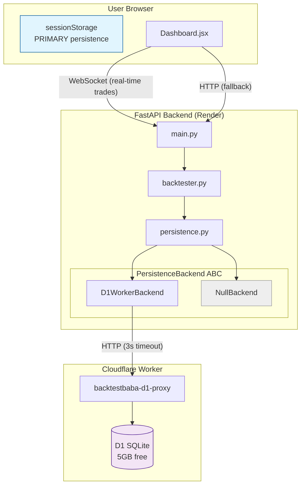
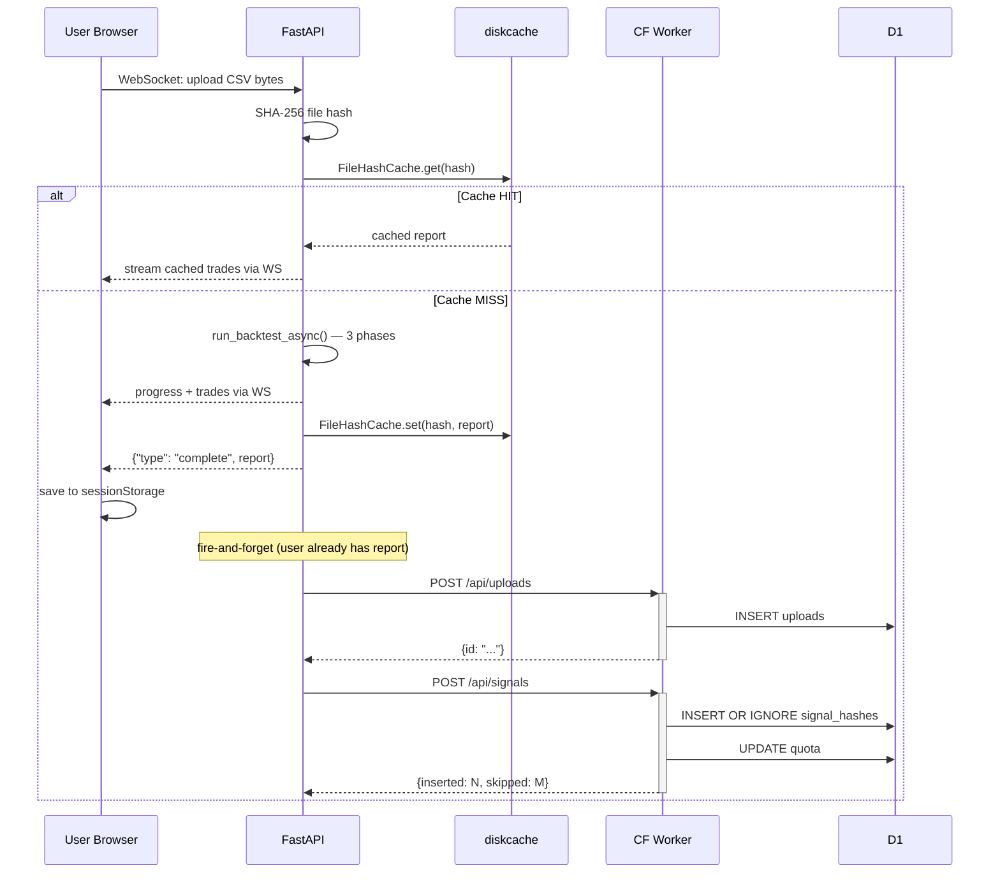
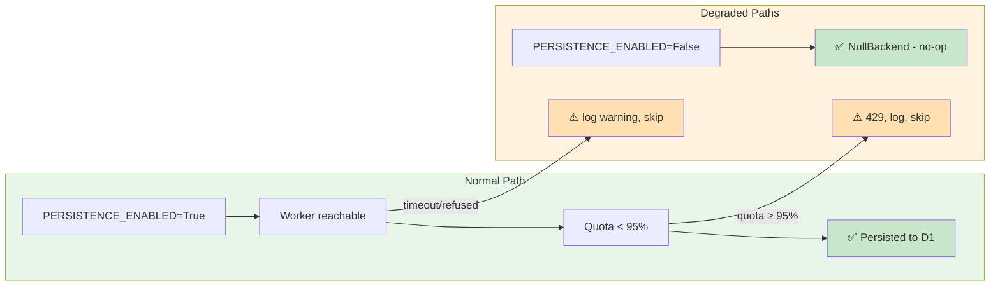

# Architecture: D1 Persistence Microservice

## System Context

BacktestBaba is a stateless CSV backtesting app. Users upload signals (symbol + date pairs), the backend fetches prices, computes returns across 6 horizons (7/14/30/45/60/90d), and streams results via WebSocket. Currently, results live only in `sessionStorage` — gone on tab close.

The D1 Persistence Microservice adds a durable, queryable, zero-cost data layer without changing the core backtest loop.

### Worker Deployment Status (as of July 2026)

| Component | Status | Notes |
|---|---|---|
| Worker URL | ✅ Live | `https://backtestbaba-d1-proxy.rockywithstocky-ff8.workers.dev` |
| D1 database `backtestbaba` | ✅ Created | Free tier, 5GB |
| D1 binding to Worker | ❌ Not configured | Must be done before Phase D |
| API endpoints | ❌ Not deployed | Default Hello World template |
| Schema (3 tables) | ❌ Not applied | Migration in Phase C |

---

## Architecture Diagram

---

## Data Flow

---

## Graceful Degradation Matrix

---

## Key Architectural Decisions

### Decision 1: Fire-and-Forget Persistence
- **What**: After backtest completes and report is cached in diskcache (`FileHashCache.set()`), a background task persists to D1.
- **Why**: The backtest result is already delivered to the user via WebSocket. Blocking on D1 adds latency with zero user benefit.
- **Impact**: If persistence fails, the user still has their report in sessionStorage.

### Decision 2: Microservice Boundary, Not Embedded
- **What**: A separate Cloudflare Worker handles all D1 interactions. FastAPI communicates only via HTTP.
- **Why**: Zero deployment coupling. Worker can be updated, migrated, or replaced without touching the backend. D1 credentials never enter the Render environment.
- **Worker URL**: `https://backtestbaba-d1-proxy.rockywithstocky-ff8.workers.dev`

### Decision 3: Abstract Backend Interface
- **What**: `PersistenceBackend` ABC with `D1WorkerBackend` and `NullBackend` implementations.
- **Why**: Swapping to Postgres, MongoDB, or local SQLite later means writing a new class — no changes to `main.py` or `backtester.py`.

### Decision 4: Row-Level Dedup via UNIQUE Constraint
- **What**: `row_hash = SHA256(symbol + "|" + date + "|" + entry_mode)` with `UNIQUE(row_hash)` in D1 schema.
- **Why**: Deterministic, input-derived (no yfinance call needed). `INSERT OR IGNORE` deduplicates at the database level with zero application logic.

### Decision 5: Single Row per Trade with JSON Blob
- **What**: `signal_hashes` table contains `results_json TEXT` — all 6 horizon returns, exit prices, max_high/low serialized as JSON.
- **Why**: Avoids normalized `trade_results` table (12x write amplification). JSON enables future AI queries without schema changes.

### Decision 6: Hard Quota Block at 95%
- **What**: `quota` singleton table tracks `total_writes`. Worker rejects writes with 429 when usage exceeds 95% of `write_limit` (default 1M).
- **Why**: Prevents surprise exhaustion. Manual export + clear gives user full control.

---

## Scope Boundaries — Explicitly Deferred

These features were discussed and intentionally reserved for future phases. They are NOT part of this build.

| Feature | Reason for Deferral | Planned Phase |
|---|---|---|
| **User auth / sessions** | D1 infra is the foundation. Auth is useless without data to protect. | P1 |
| **IndexedDB (client L2)** | sessionStorage + D1 is sufficient for current scale. | P3 |
| **Admin panel** | Must come after auth and persist pipeline are stable. | P4 |
| **T-001 entry_mode dispatch** | Trivial refactor, unrelated to persistence. Zero dependency. | After D1 |
| **AI queries on results_json** | The blob is designed for it, but the query layer is future work. | Future |

Nothing in these deferred items is blocked by the D1 integration. Adding them later requires zero schema changes — the data is already there.

---

## Zero Regression Guarantee

| Property | How It Is Preserved |
|---|---|
| Backtest math | Persistence runs AFTER computation. `backtester.py` is unchanged. |
| WebSocket delivery | `asyncio.create_task` runs AFTER `await websocket.send(...)`. User receives report before D1 write begins. |
| FileHashCache | Persistence runs AFTER `FileHashCache.set()`. Existing cache behavior is identical. |
| Test suite | All existing tests import `main.py`, `backtester.py`, `schemas.py` — none import `persistence.py`. When `PERSISTENCE_ENABLED=False` (default), `NullBackend` produces zero side effects. |
| Error handling | All Worker calls wrapped in try/except with 3s timeout. No unhandled exceptions escape. |
| HTTP endpoints | `POST /api/backtest` returns synchronously. Fire-and-forget persistence runs after response is sent. No latency increase. |
