# 001 — Entry Mode: Next Candle Open / Close

**Priority**: P1 (Active)
**Status**: Design Complete — Ready for Implementation
**Dependencies**: None

---

## 1. Problem Statement

### Current Behavior (Broken)

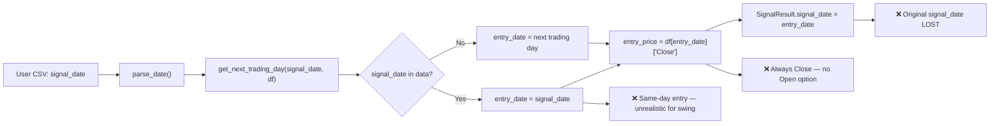

Three issues:
1. **`signal_date` is overwritten** with `entry_date` in the result — user loses the original signal date
2. **Entry always uses Close price** — no option to use Open price of next candle
3. **Entry can be same-day** if `signal_date` is a trading day — unrealistic for swing trading (signal arrives at market close, cannot trade same day)

### Desired Behavior

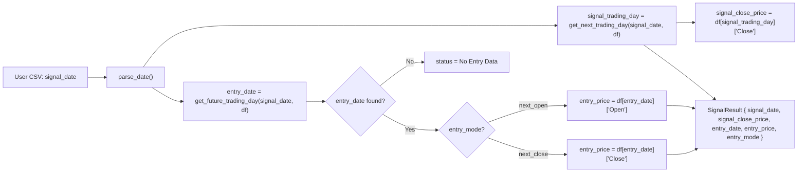

Key changes:
- `signal_date` = original user date (preserved)
- `signal_close_price` = Close on nearest trading day to signal_date
- `entry_date` = always the **next** trading day (never same-day)
- `entry_price` = Open or Close of entry_date based on `entry_mode`
- `entry_mode` = tracked in the result for transparency

---

## 2. Architecture Overview

### 2.1 System Context

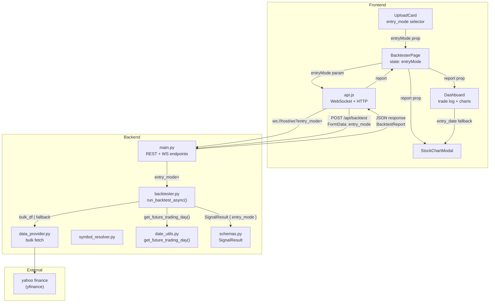

### 2.2 Component Tree — Frontend

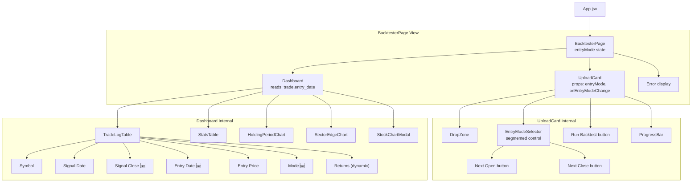

---

## 3. Data Flow & Sequence

### 3.1 Full Backtest Sequence

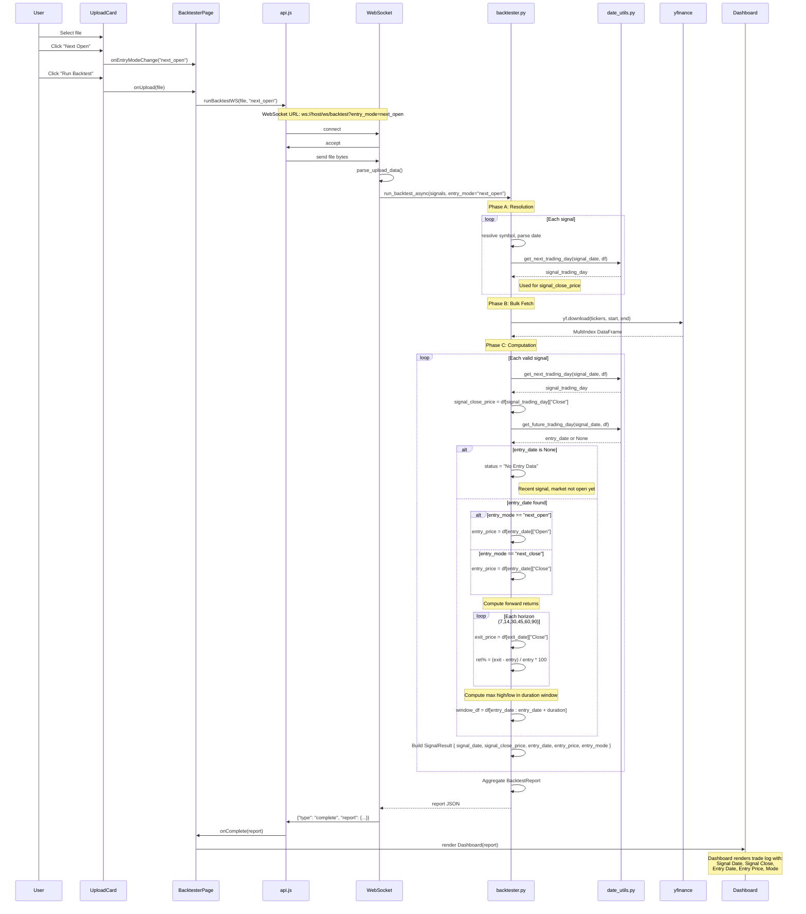

### 3.2 Entry Price Decision Tree

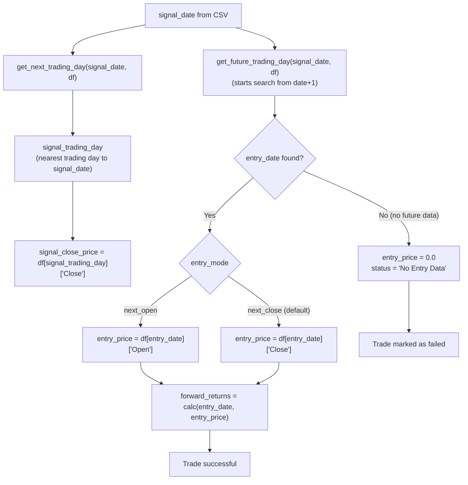

### 3.3 Date Lookup Comparison

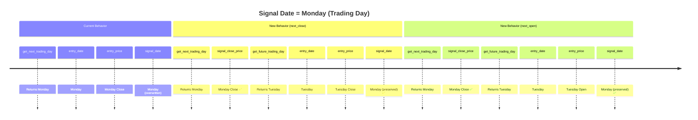

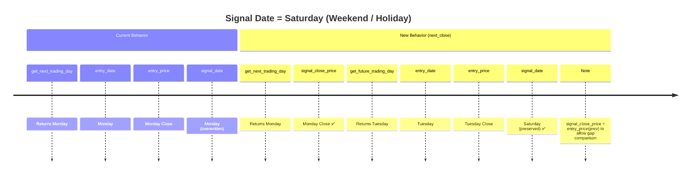

---

## 4. Specification

### 4.1 Schema Changes (`backend/models/schemas.py`)

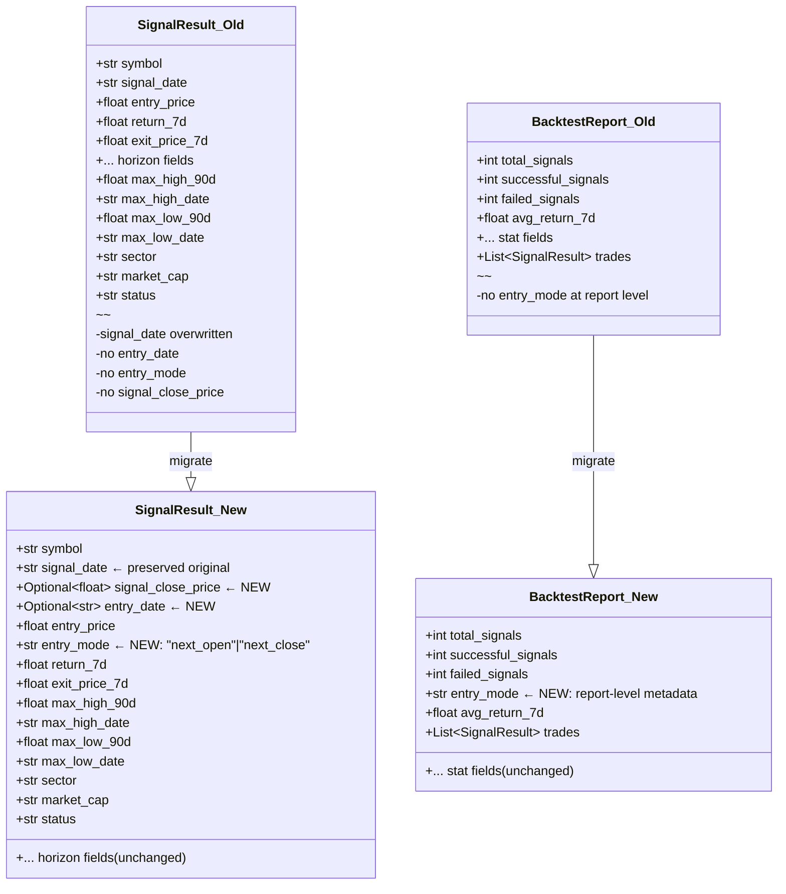

**Exact field additions**:

```python
# SignalResult — add these fields (order matters for Pydantic)
signal_close_price: Optional[float] = None   # Close on/nearest to signal_date
entry_date: Optional[str] = None             # Actual trading day used for entry
entry_mode: str = "next_close"               # "next_open" | "next_close"

# BacktestReport — add this field
entry_mode: str = "next_close"               # Report-level metadata
```

**Why `Optional` for `entry_date` and `signal_close_price`**?
- Failed trades (status != "Success") won't have these — `entry_price=0.0` and no entry
- Old saved reports won't have these fields — frontend must handle `None` gracefully

### 4.2 Date Utils (`backend/utils/date_utils.py`)

**New function**:

```python
def get_future_trading_day(date: datetime, data: pd.DataFrame, max_lookahead: int = 5) -> datetime | None:
    """
    Finds the NEXT trading day AFTER 'date'.
    Unlike get_next_trading_day, this ALWAYS skips the current date.
    Used to ensure entry is always the next candle (never same-day).
    
    | Input Date    | get_next_trading_day  | get_future_trading_day  |
    |---------------|----------------------|------------------------|
    | Mon (trading) | Mon ✅               | Tue ✅                  |
    | Sat (holiday) | Mon                   | Tue                     |
    | Recent (no    | signal_date (last    | None ❌ (no data)       |
    |   future data)|  available day)      |                         |
    """
    for i in range(1, max_lookahead + 1):
        target_date = date + timedelta(days=i)
        if target_date in data.index:
            return target_date
    return None
```

**Behavior matrix**:

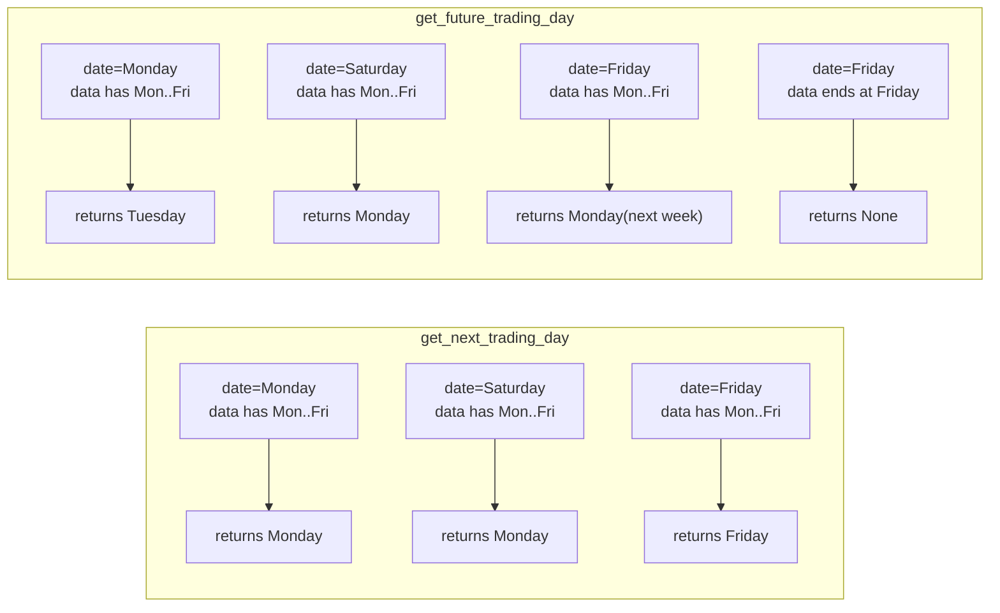

### 4.3 Backtester Logic (`backend/core/backtester.py`)

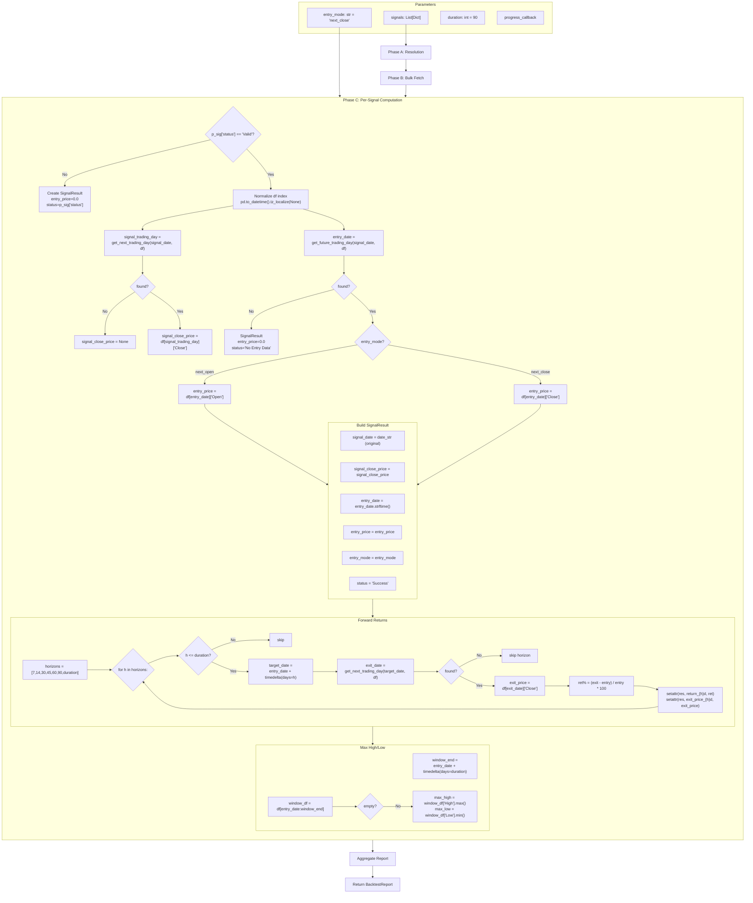

**Key code changes** — current lines 173-197 become:

```python
# Line ~173: df.index already normalized from earlier

# --- Signal Close Price (nearest trading day to signal_date) ---
signal_trading_day = get_next_trading_day(signal_date, df)
signal_close_price = (df.loc[signal_trading_day]["Close"]
                      if signal_trading_day is not None
                      else None)

# --- Entry Date (always NEXT trading day) ---
entry_date = get_future_trading_day(signal_date, df)
if not entry_date:
    results.append(SignalResult(
        symbol=resolved_symbol,
        signal_date=date_str,                    # ← original date preserved
        signal_close_price=signal_close_price,
        entry_price=0.0,
        entry_mode=entry_mode,
        status="No Entry Data"
    ))
    continue

# --- Entry Price (mode-dependent) ---
if entry_mode == "next_open":
    entry_price = df.loc[entry_date]["Open"]
else:  # "next_close" (default)
    entry_price = df.loc[entry_date]["Close"]

# --- Build result ---
res = SignalResult(
    symbol=resolved_symbol,
    signal_date=date_str,                        # ← original date, NOT overwritten
    signal_close_price=round(signal_close_price, 2) if signal_close_price else None,
    entry_date=entry_date.strftime("%Y-%m-%d"),
    entry_price=round(entry_price, 2),
    entry_mode=entry_mode,
    sector=metadata_map.get(resolved_symbol, {}).get("sector"),
    market_cap=...,
    status="Success"
)
```

### 4.4 API Changes (`backend/main.py`)

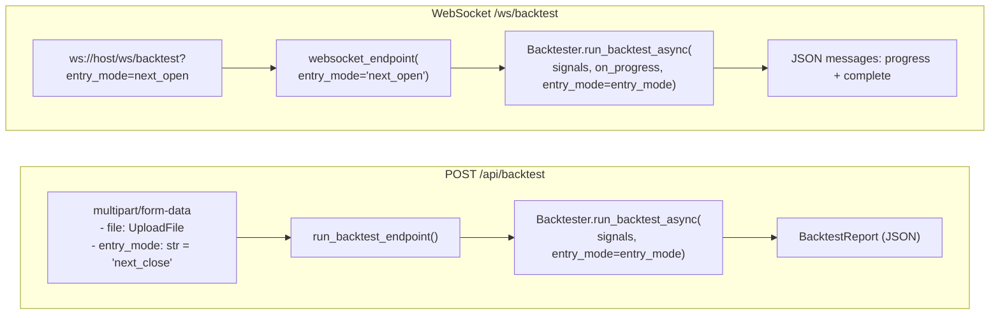

**REST endpoint**:
```python
@app.post("/api/backtest", response_model=BacktestReport)
async def run_backtest_endpoint(
    file: UploadFile = File(...),
    entry_mode: str = Form("next_close")        # ← NEW
):
    contents = await file.read()
    df = parse_upload_data(contents)
    signals = df.to_dict(orient="records")
    report = await Backtester.run_backtest_async(signals, entry_mode=entry_mode)
    return report
```

**WebSocket endpoint**:
```python
@app.websocket("/ws/backtest")
async def websocket_endpoint(
    websocket: WebSocket,
    entry_mode: str = "next_close"              # ← NEW (from query string)
):
    await websocket.accept()
    data = await websocket.receive_bytes()
    df = parse_upload_data(data)
    signals = df.to_dict(orient="records")

    async def on_progress(current, total, symbol):
        await websocket.send_json({"type": "progress", "current": current, "total": total, "symbol": symbol})

    report = await Backtester.run_backtest_async(signals, on_progress, entry_mode=entry_mode)
    await websocket.send_json({"type": "complete", "report": report.dict()})
```

### 4.5 Frontend API (`frontend/src/services/api.js`)

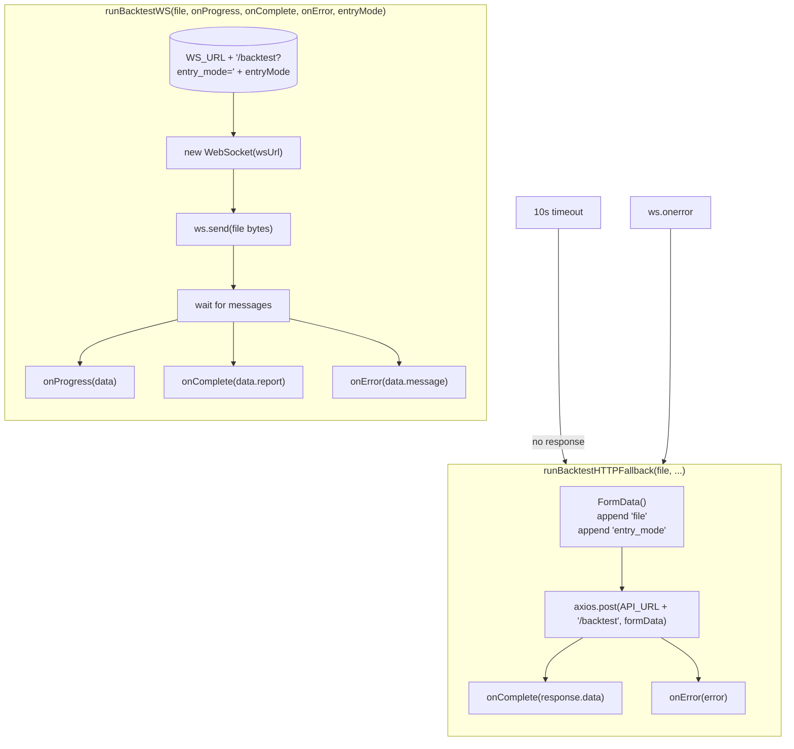

### 4.6 UploadCard — Entry Mode Selector

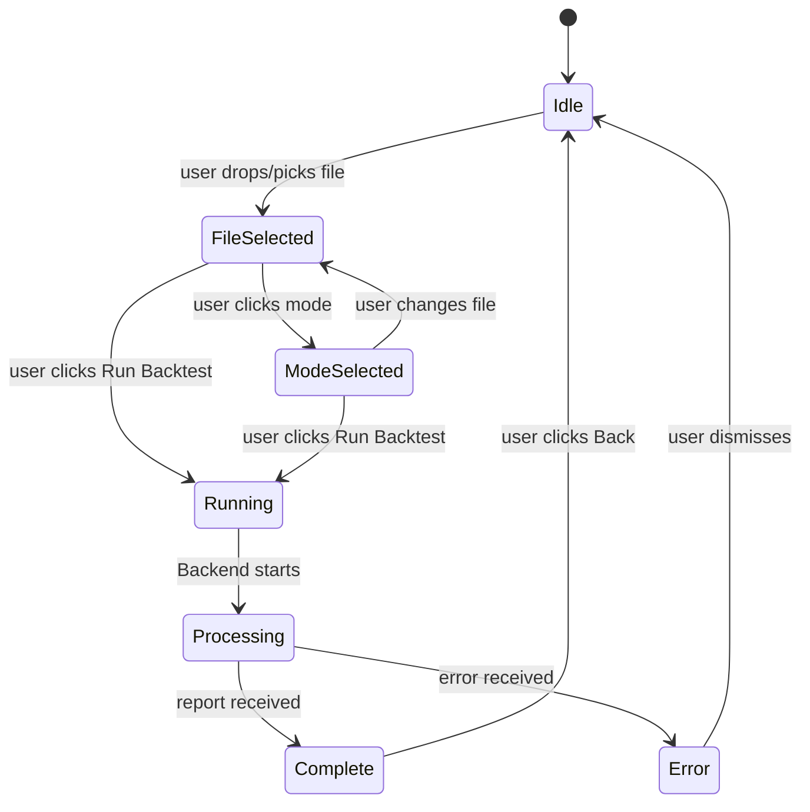

**Component structure in `UploadCard.jsx`**:

```jsx
const UploadCard = ({ onUpload, isLoading, progress, entryMode, onEntryModeChange }) => {
    // state: file, dragActive

    const handleSubmit = () => { if (file) onUpload(file); };

    return (
        <div className="upload-card">
            {/* Drop zone — unchanged */}
            <div className="drop-zone" onDragEnter.. onDrop..>
                <input type="file" /> <label>...</label>
            </div>

            {/* ENTRY MODE SELECTOR — NEW */}
            <div className="entry-mode-selector">
                <span className="entry-mode-label">Entry Mode:</span>
                <div className="entry-mode-toggle">
                    <button
                        className={`mode-btn ${entryMode === 'next_open' ? 'active' : ''}`}
                        onClick={() => onEntryModeChange('next_open')}
                        disabled={isLoading}
                    >
                        Next Open
                    </button>
                    <button
                        className={`mode-btn ${entryMode === 'next_close' ? 'active' : ''}`}
                        onClick={() => onEntryModeChange('next_close')}
                        disabled={isLoading}
                    >
                        Next Close
                    </button>
                </div>
            </div>

            {/* Submit button — unchanged */}
            {file && !isLoading && <button onClick={handleSubmit}>Run Backtest</button>}

            {/* Progress bar — unchanged */}
            <AnimatePresence>...</AnimatePresence>
        </div>
    );
};
```

### 4.7 Dashboard — Trade Log Changes

```mermaid
flowchart LR
    subgraph BEFORE ["Current Trade Log Columns"]
        C1["Symbol"]
        C2["Date<br/>(was entry_date)"]
        C3["Entry"]
        C4["1W Return"]
        C5["1M Return"]
        C6["3M Return"]
        C7["Max High"]
        C8["Max Low"]
        
        C1 --- C2 --- C3 --- C4 --- C5 --- C6 --- C7 --- C8
        style C2 fill:#ffcccc,stroke:#ff0000
        note right of C2 "Misleading label<br/>signal_date = entry_date"
    end
    
    subgraph AFTER ["Proposed Trade Log Columns"]
        D1["Symbol"]
        D2["Signal Date"]
        D3["Signal Close 🆕"]
        D4["Entry Date 🆕"]
        D5["Entry Price"]
        D6["Mode 🆕"]
        D7["1W Return"]
        D8["1M Return"]
        D9["3M Return"]
        D10["Max High"]
        D11["Max Low"]
        
        D1 --- D2 --- D3 --- D4 --- D5 --- D6 --- D7 --- D8 --- D9 --- D10 --- D11
        
        style D2 fill:#d4f5d4,stroke:#00aa00
        note right of D2 "Original signal date<br/>Preserved, never overwritten"
        style D3 fill:#d4f5d4,stroke:#00aa00
        note right of D3 "Close on signal_date<br/>Shows trigger price"
        style D4 fill:#d4f5d4,stroke:#00aa00
        note right of D4 "Actual trade date<br/>Always next candle"
        style D6 fill:#d4f5d4,stroke:#00aa00
        note right of D6 "Open / Close badge"
    end
```

**Backward compatibility fallback pattern**:

```javascript
// In Dashboard.jsx — trade rendering
const renderTradeRow = (trade, idx) => {
    // Handle old reports (no entry_date, signal_close_price)
    const signalDate = trade.signal_date || '-';
    const signalClose = trade.signal_close_price ?? null;
    const entryDate = trade.entry_date || trade.signal_date;    // ← fallback
    const entryPrice = trade.entry_price;
    const entryMode = trade.entry_mode || 'next_close';          // ← fallback

    return (
        <tr key={idx}>
            <td className="symbol-cell">{trade.symbol}</td>
            <td>{signalDate}</td>
            <td>{signalClose ? formatCurrency(signalClose) : '-'}</td>
            <td>{entryDate}</td>
            <td>{formatCurrency(entryPrice)}</td>
            <td><span className="mode-badge">{entryMode === 'next_open' ? 'Open' : 'Close'}</span></td>
            <td ...>...</td>
            {/* ... rest of the columns */}
        </tr>
    );
};
```

**`getExitDate` fix** — must use `entry_date` for accurate exit calculation:

```javascript
// Before (Line 165-170)
const getExitDate = (entryDate, period) => {
    const days = period === '7d' ? 7 : period === '30d' ? 30 : 90;
    const date = new Date(entryDate);       // ← was trade.signal_date
    date.setDate(date.getDate() + days);
    return date.toLocaleDateString('en-IN');
};

// After
const getExitDate = (trade, period) => {    // ← now takes trade object
    const days = period === '7d' ? 7 : period === '30d' ? 30 : 90;
    const date = new Date(trade.entry_date || trade.signal_date);  // ← uses entry_date
    date.setDate(date.getDate() + days);
    return date.toLocaleDateString('en-IN');
};
```

**`getTooltipContent` fix**:

```javascript
// Before (Line 178-184)
const getTooltipContent = (trade, period) => {
    const exitPriceKey = `exit_price_${period}`;
    const exitDate = getExitDate(trade.signal_date, period);   // ← was passing string
    const exitPrice = trade[exitPriceKey];
    return `📅 Exit Date: ${exitDate}\n💰 Exit Price: ${formatCurrency(exitPrice)}`;
};

// After
const getTooltipContent = (trade, period) => {
    const exitPriceKey = `exit_price_${period}`;
    const exitDate = getExitDate(trade, period);                // ← now passes trade object
    const exitPrice = trade[exitPriceKey];
    return `Exit Date: ${exitDate}\nExit Price: ${formatCurrency(exitPrice)}`;
};
```

**`handleSort` update** — fix signal_date sorting (was working, still works):

```javascript
// Line 141-144 — no change needed, signal_date is still a string date
if (sortConfig.key === 'signal_date') {
    aVal = new Date(aVal).getTime();
    bVal = new Date(bVal).getTime();
}

// Potentially add entry_date sorting
if (sortConfig.key === 'entry_date') {
    aVal = new Date(aVal).getTime();
    bVal = new Date(bVal).getTime();
}
```

**`handleCellClick` update** — passes trade to StockChartModal (unchanged):

```javascript
// Line 172-175 — no change, StockChartModal only needs trade object
const handleCellClick = (trade, period) => {
    setSelectedStock(trade);
    setSelectedPeriod(period);
};
```

### 4.8 StockChartModal Changes

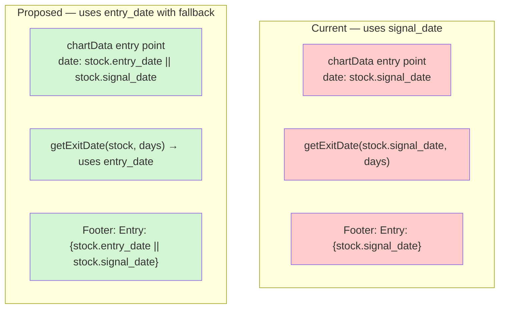

**Line-by-line changes in `StockChartModal.jsx`**:

| Line | Current Code | New Code |
|---|---|---|
| 27 | `const exitDate = getExitDate(stock.signal_date, periodDays);` | `const entryDate = stock.entry_date \|\| stock.signal_date; const exitDate = getExitDate(entryDate, periodDays);` |
| 34 | `date: stock.signal_date,` | `date: stock.entry_date \|\| stock.signal_date,` |
| 134 | `<span className="modal-stat-date">{stock.signal_date}</span>` | `<span className="modal-stat-date">{stock.entry_date \|\| stock.signal_date}</span>` |
| 234 | `<strong>Entry:</strong> {stock.signal_date}` | `<strong>Entry:</strong> {stock.entry_date \|\| stock.signal_date} \| <strong>Signal:</strong> {stock.signal_date}` |

---

## 5. Regression & Impact Analysis

### 5.1 Before/After Result Comparison

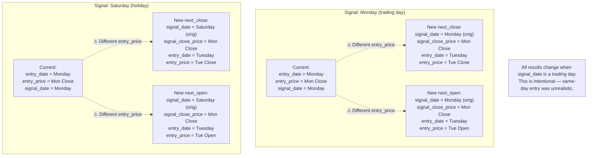

### 5.2 Regression Impact Matrix

| Scenario | Current | After (next_close) | After (next_open) | Breakage |
|---|---|---|---|---|
| Mon signal, Mon data | entry=Mon, price=Mon Close | signal_date=Mon, signal_close=Mon Close, entry=Tue, price=Tue Close | signal_date=Mon, signal_close=Mon Close, entry=Tue, price=Tue Open | **Yes** — entry_price changes |
| Sat signal, Mon data | entry=Mon, price=Mon Close | signal_date=Sat, signal_close=Mon Close, entry=Tue, price=Tue Close | signal_date=Sat, signal_close=Mon Close, entry=Tue, price=Tue Open | **Yes** — entry_price changes |
| All historical | Stable but shifted | +1d entry for same-day signals | +1d + Open price | Re-run required |
| Old report JSON loaded | N/A | Missing entry_date, signal_close_price, entry_mode | — | Handled by `\|\|` fallback |
| Recent signal, no future data | entry=last date | No Entry Data | No Entry Data | Status quo |

**Acceptance criteria**: This regression is **by design**. The old behavior (same-day entry) was incorrect for swing trading. Users must re-run old files to get accurate results.

### 5.3 Premortem — Failure Mode & Effects Analysis

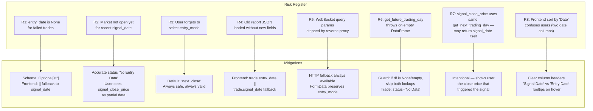

### 5.4 Edge Cases

| Edge Case | What Happens | Expected? |
|---|---|---|
| `df.index` contains `NaT` or duplicates | `get_next_trading_day` / `get_future_trading_day` may misbehave | Low risk — yfinance returns clean index |
| `df` has no `Open` column (unlikely) | `df.loc[entry_date]["Open"]` raises `KeyError` | Very low — yfinance always returns OHLCV |
| User passes `entry_mode=INVALID` | Python default catches → `else` branch → `next_close` | Safe |
| Bulk_df is MultiIndex with 1 column | `isinstance(bulk_df.columns, pd.MultiIndex)` check handles it | Already handled |
| Signal date format unsupported | `parse_date()` raises → caught → `Invalid Date` status | Already handled |
| Multiple signals for same symbol, different dates | Each signal separately resolved — no conflict | Already handled |

---

## 6. Implementation Plan

### 6.1 Dependency Graph

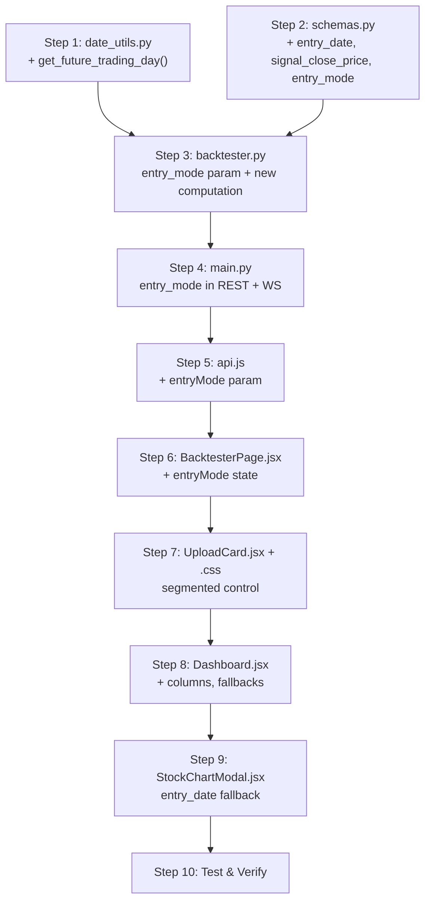

### 6.2 Step-by-Step Instructions

| Step | File | Action | Test Verification |
|---|---|---|---|
| 1 | `backend/utils/date_utils.py` | Add `get_future_trading_day()` — loop from `i=1` to `max_lookahead` | Unit: returns None when no future day; returns next day when signal_date is trading day |
| 2 | `backend/models/schemas.py` | Add 3 fields to `SignalResult`, 1 field to `BacktestReport` | Pydantic validates; `report.dict()` includes new fields |
| 3 | `backend/core/backtester.py` | Accept `entry_mode`; add signal_close_price, entry_date, entry_price logic; preserve signal_date | `pytest backend/tests/ -v --asyncio-mode=auto` |
| 4 | `backend/main.py` | Add `entry_mode: str = Form("next_close")` to REST; add `entry_mode: str = "next_close"` to WS | Test via Swagger UI: POST with entry_mode field |
| 5 | `frontend/src/services/api.js` | Add `entryMode` param to both functions | Manual: check WS URL includes `?entry_mode=` |
| 6 | `frontend/src/pages/BacktesterPage.jsx` | Add `const [entryMode, setEntryMode] = useState('next_close')`; pass to UploadCard + API | Manual: state flows correctly |
| 7 | `frontend/src/components/UploadCard.jsx` + `.css` | Add segmented control between drop zone and submit button | Visual: toggle works, active/inactive states styled |
| 8 | `frontend/src/components/Dashboard.jsx` | Add 3 columns; rename "Date" → "Signal Date"; fix `getExitDate`; fix `getTooltipContent` | Manual: trade log renders correctly with new columns |
| 9 | `frontend/src/components/StockChartModal.jsx` | Fix entry point date, footer | Manual: modal shows entry_date as entry point |
| 10 | Test | `pytest backend/tests/ -v --asyncio-mode=auto`; `cd frontend && npm run lint`; manual upload | All tests pass, lint clean |

### 6.3 Test Scenarios

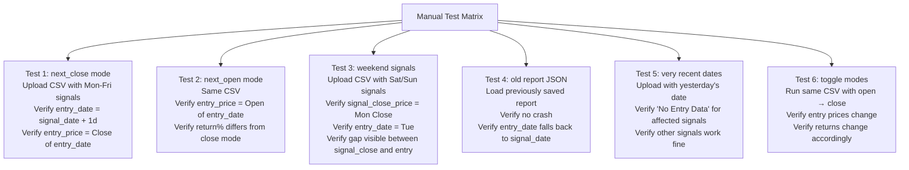

---

## 7. Files Changed Summary

| File | Change Type | Lines Changed |
|---|---|---|
| `backend/utils/date_utils.py` | **+1 function** | +8 |
| `backend/models/schemas.py` | **+4 fields** (3 SignalResult + 1 BacktestReport) | +5 |
| `backend/core/backtester.py` | **+entry_mode param** + signal_close_price/entry_date/entry_price logic | ~30 |
| `backend/main.py` | **+2 params** (REST + WS) | +4 |
| `frontend/src/services/api.js` | **+entryMode param** in both functions | +4 |
| `frontend/src/pages/BacktesterPage.jsx` | **+entryMode state** | +3 |
| `frontend/src/components/UploadCard.jsx` | **+segmented control** | +25 |
| `frontend/src/components/UploadCard.css` | **+toggle styles** | +20 |
| `frontend/src/components/Dashboard.jsx` | **+3 columns** + fallbacks + getExitDate fix | ~30 |
| `frontend/src/components/StockChartModal.jsx` | **+entry_date fallback** in 4 places | +4 |

**Total: ~133 lines across 10 files**
