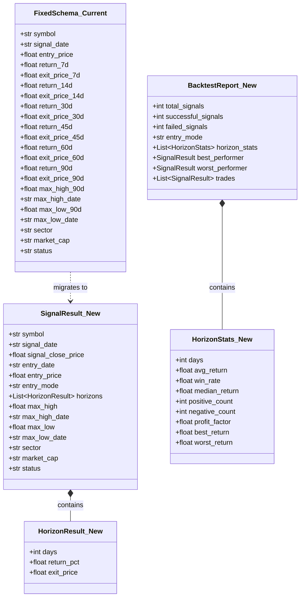
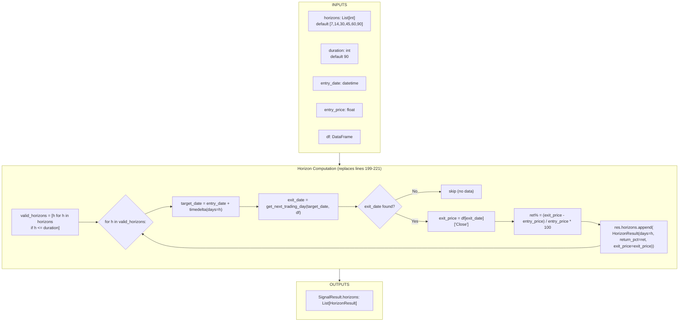
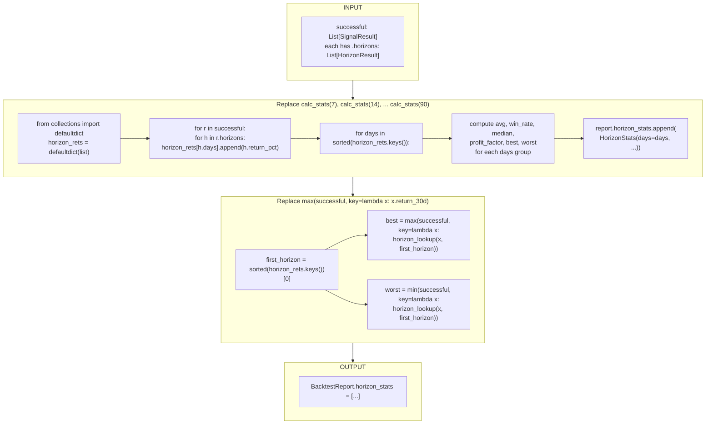
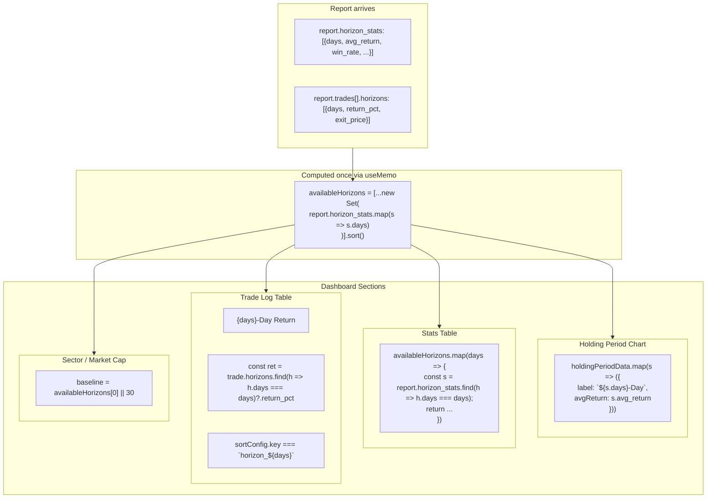
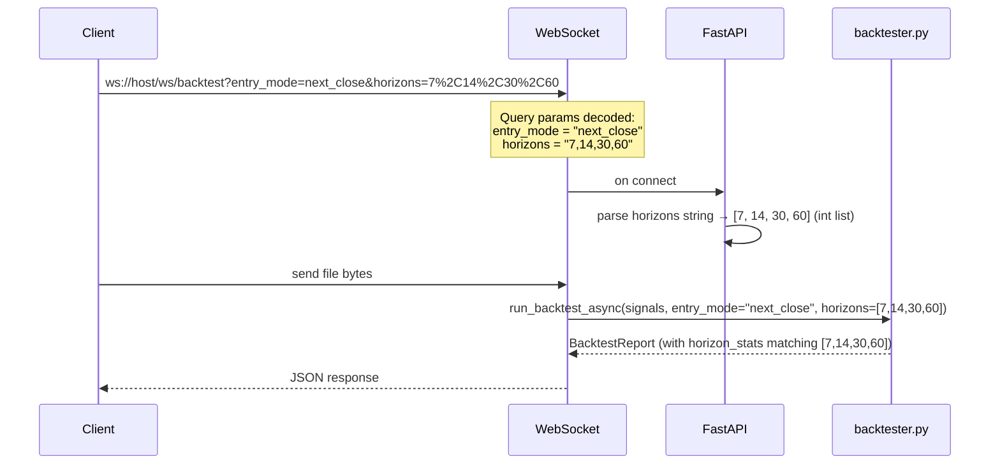
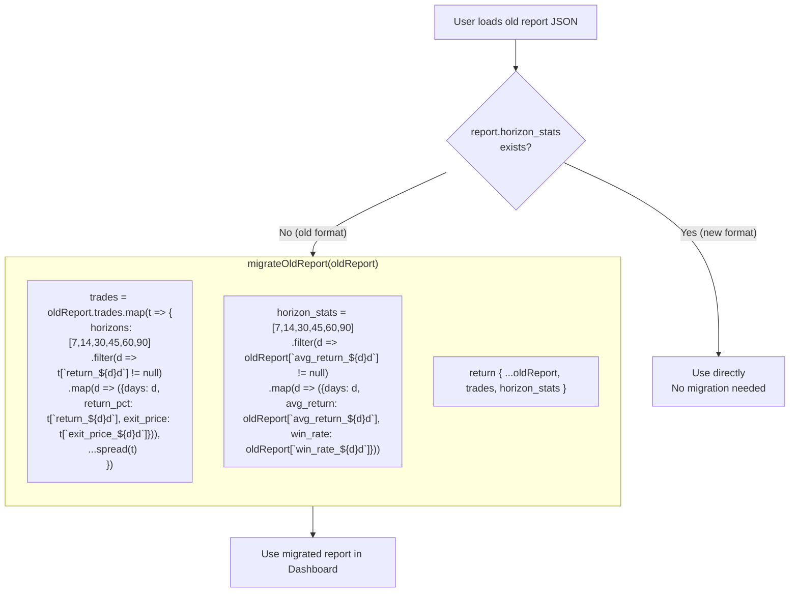
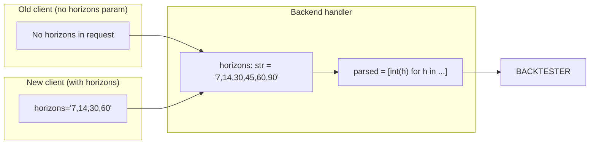
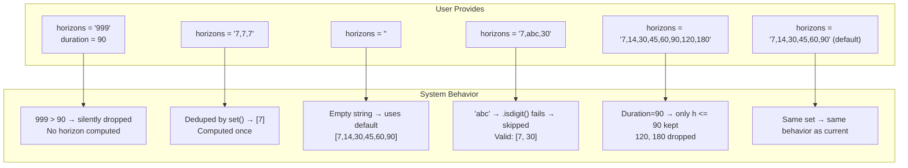
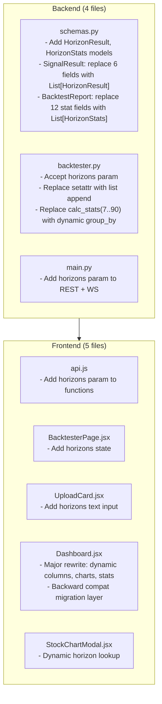

# 002 — Dynamic Horizons (Path B)

**Priority**: P3 (Shelf — Design Only, No Implementation)
**Status**: Design Complete — Not Scheduled for Implementation
**Dependencies**: None
**Constraint**: This is a **design-only document**. Do not implement any code changes based on this doc until it is promoted to P1/P2.

---

## 1. Problem Statement

### Current Architecture (Rigid)

```mermaid
flowchart LR
    subgraph SCHEMA_CURRENT ["schemas.py — 6 hardcoded fields"]
        F7["return_7d: float"]
        F14["return_14d: float"]
        F30["return_30d: float"]
        F45["return_45d: float"]
        F60["return_60d: float"]
        F90["return_90d: float"]
    end

    subgraph BACKTESTER_CURRENT ["backtester.py — 2 hardcoded lists"]
        HARD["horizons = sorted(set([7, 14, 30, 45, 60, 90, duration]))"]
        FILTER["if h in [7, 14, 30, 45, 60, 90]: setattr(...)"]
        style FILTER fill:#ffcccc
        note right of FILTER "Any horizon not in this list<br/>is SILENTLY DROPPED"
    end

    subgraph FRONTEND_CURRENT ["Dashboard.jsx — 3 of 6 rendered"]
        STATS["statsTable: ['7d', '30d', '90d']"]
        TRADE["tradeLog: return_7d, return_30d, return_90d"]
        CHART["chart: 7d, 14d, 30d, 45d, 60d, 90d"]
    end

    HARD --> FILTER
    FILTER --> SCHEMA_CURRENT
    SCHEMA_CURRENT --> FRONTEND_CURRENT
```

**Consequences**:
1. Adding a new horizon (e.g., `return_10d`) requires changes in **3 layers** × **6 files**
2. User has zero control over which horizons to compute
3. The `duration` parameter can be customized but only acts as a cap — not a reporting horizon
4. Only 3 of 6 computed horizons are shown in the Dashboard stats table

### Desired Architecture (Dynamic)

```mermaid
flowchart LR
    subgraph USER_INPUT ["User provides"]
        HORIZONS_IN["horizons = '7,10,21,63,180'"]
    end

    subgraph BACKEND ["Backend — single list, any values"]
        COMPUTE["for h in horizons:<br/>exit_price = ...<br/>ret% = ...<br/>HorizonResult(days=h, ...)"]
        AGG["group_by days<br/>→ HorizonStats per days"]
    end

    subgraph FRONTEND ["Frontend — renders whatever is in the data"]
        COLS["<th>7-Day</th><th>10-Day</th><th>21-Day</th>..."]
        STATS_DYN["avg_return: 7→x, 10→y, 21→z..."]
        CHART_DYN["bars: one per available horizon"]
    end

    HORIZONS_IN --> COMPUTE
    COMPUTE --> AGG
    AGG --> COLS
    AGG --> STATS_DYN
    AGG --> CHART_DYN

    note right of COMPUTE "No setattr, no conditionals<br/>Just append to List[HorizonResult]"
    note right of COLS "No hardcoded column list<br/>Columns = unique days from data"
```

---

## 2. Design

### 2.1 Schema Evolution



**Key structural changes**:

```
Current:
  SignalResult.return_7d = 2.5
  SignalResult.return_30d = -1.2
  SignalResult.return_90d = 5.8
  → 6 individual fixed fields

Future:
  SignalResult.horizons = [
    {days: 7,  return_pct: 2.5,  exit_price: 102.50},
    {days: 10, return_pct: 3.1,  exit_price: 103.10},
    {days: 21, return_pct: -0.5, exit_price: 99.50},
    {days: 63, return_pct: 8.7,  exit_price: 108.70},
    {days: 180, return_pct: 15.2, exit_price: 115.20},
  ]
  → 1 list, any days, any count
```

**Renaming note**: `max_high_90d` → `max_high` and `max_low_90d` → `max_low`. The "90d" suffix was misleading — these are the max within the user-configured `duration`, not a fixed 90-day window.

### 2.2 Backtester Computation Flow



**Code excerpt** — replaces current lines 199-221:

```python
# Build the list of horizons to compute
user_horizons = horizons or [7, 14, 30, 45, 60, 90]
valid_horizons = sorted([h for h in user_horizons if h <= duration])

# Compute each horizon
for h in valid_horizons:
    target_date = entry_date + timedelta(days=h)
    exit_date = get_next_trading_day(target_date, df)
    if exit_date:
        exit_price = round(df.loc[exit_date]["Close"], 2)
        ret = round(((exit_price - entry_price) / entry_price) * 100, 2)
        res.horizons.append(HorizonResult(
            days=h,
            return_pct=ret,
            exit_price=exit_price
        ))
```

### 2.3 Report Aggregation Flow



**Code excerpt** — replaces current lines 240-270:

```python
from collections import defaultdict

successful = [r for r in results if r.status == "Success"]
report = BacktestReport(
    total_signals=len(signals),
    successful_signals=len(successful),
    failed_signals=len(signals) - len(successful),
    trades=results,
    entry_mode=entry_mode
)

if successful:
    # Group returns by horizon days
    horizon_rets = defaultdict(list)
    for r in successful:
        for h in r.horizons:
            horizon_rets[h.days].append(h.return_pct)

    for days in sorted(horizon_rets.keys()):
        rets = horizon_rets[days]
        avg = round(sum(rets) / len(rets), 2)
        win_rate = round((len([x for x in rets if x > 0]) / len(rets)) * 100, 2)
        pos = [x for x in rets if x > 0]
        neg = [x for x in rets if x < 0]
        gross_profit = sum(pos)
        gross_loss = abs(sum(neg))
        pf = round(gross_profit / gross_loss, 2) if gross_loss > 0 else (float('inf') if gross_profit > 0 else 0)
        sorted_rets = sorted(rets)
        median = (sorted_rets[len(sorted_rets)//2] if len(sorted_rets) % 2
                  else (sorted_rets[len(sorted_rets)//2 - 1] + sorted_rets[len(sorted_rets)//2]) / 2)
        
        report.horizon_stats.append(HorizonStats(
            days=days,
            avg_return=avg,
            win_rate=win_rate,
            median_return=round(median, 2),
            positive_count=len(pos),
            negative_count=len(neg),
            profit_factor=pf if pf != float('inf') else None,
            best_return=round(max(rets), 2),
            worst_return=round(min(rets), 2)
        ))

    # Best/worst based on shortest horizon
    first_days = sorted(horizon_rets.keys())[0] if horizon_rets else None
    if first_days:
        def lookup(trade, d):
            h = next((hr for hr in trade.horizons if hr.days == d), None)
            return h.return_pct if h else None

        report.best_performer = max(successful, key=lambda x: lookup(x, first_days) or -999)
        report.worst_performer = min(successful, key=lambda x: lookup(x, first_days) or 999)
```

### 2.4 Frontend — Dynamic Rendering



**Key frontend changes**:

```javascript
// === 1. Available horizons (derived from data) ===
const availableHorizons = useMemo(() => {
    return [...new Set(
        (report.horizon_stats || []).map(s => s.days)
    )].sort((a, b) => a - b);
}, [report.horizon_stats]);

// === 2. Helper to get a trade's return for a specific horizon ===
const getHorizonReturn = (trade, days) => {
    if (!trade.horizons) return null;
    const h = trade.horizons.find(h => h.days === days);
    return h?.return_pct ?? null;
};

const getExitPrice = (trade, days) => {
    if (!trade.horizons) return null;
    const h = trade.horizons.find(h => h.days === days);
    return h?.exit_price ?? null;
};

// === 3. Holding Period Chart data ===
const holdingPeriodData = useMemo(() => {
    return (report.horizon_stats || []).map(s => ({
        days: s.days,
        label: `${s.days}-Day`,
        avgReturn: s.avg_return || 0,
        winRate: s.win_rate || 0
    }));
}, [report.horizon_stats]);

// === 4. Trade log table header (dynamic columns) ===
<thead>
    <tr>
        <th>Symbol</th>
        <th>Signal Date</th>
        <th>Entry Date</th>
        <th>Entry Price</th>
        {availableHorizons.map(days => (
            <th key={days} onClick={() => handleSort(`horizon_${days}`)}>
                {days}-Day Return
            </th>
        ))}
        <th>Max High</th>
        <th>Max Low</th>
    </tr>
</thead>

// === 5. Trade log table body (dynamic values) ===
<tbody>
    {paginatedTrades.map((trade, idx) => (
        <tr key={idx}>
            <td>{trade.symbol}</td>
            <td>{trade.signal_date}</td>
            <td>{trade.entry_date}</td>
            <td>{formatCurrency(trade.entry_price)}</td>
            {availableHorizons.map(days => {
                const ret = getHorizonReturn(trade, days);
                const exitPrice = getExitPrice(trade, days);
                return (
                    <td key={days}
                        className={`clickable-cell ${getColorClass(ret)}`}
                        onClick={() => handleCellClick(trade, days)}
                        title={`Exit Price: ${formatCurrency(exitPrice)}`}
                    >
                        {formatPercent(ret)}
                    </td>
                );
            })}
            <td>...</td>
            <td>...</td>
        </tr>
    ))}
</tbody>

// === 6. Sorting with dynamic horizon keys ===
const handleSort = (key) => {
    setSortConfig(prev => ({
        key,
        direction: prev.key === key && prev.direction === 'asc' ? 'desc' : 'asc'
    }));
};

// In sortedTrades useMemo:
sorted.sort((a, b) => {
    let aVal, bVal;
    if (sortConfig.key.startsWith('horizon_')) {
        const days = parseInt(sortConfig.key.replace('horizon_', ''));
        aVal = getHorizonReturn(a, days) ?? -Infinity;
        bVal = getHorizonReturn(b, days) ?? -Infinity;
    } else if (sortConfig.key === 'entry_date') {
        aVal = new Date(a[sortConfig.key]).getTime();
        bVal = new Date(b[sortConfig.key]).getTime();
    } else {
        aVal = a[sortConfig.key] ?? -Infinity;
        bVal = b[sortConfig.key] ?? -Infinity;
    }
    return sortConfig.direction === 'asc' ? aVal - bVal : bVal - aVal;
});

// === 7. StockChartModal dynamic lookup ===
// Before (current):
// const ret = stock[`return_${period}`];
// const exitPrice = stock[`exit_price_${period}`];

// After:
const periodDays = parseInt(period);  // period is now numeric (7, 14, 30), not string ('7d')
const horizonEntry = (stock.horizons || []).find(h => h.days === periodDays);
const ret = horizonEntry?.return_pct;
const exitPrice = horizonEntry?.exit_price;
```

### 2.5 API Contract



**REST endpoint signature**:
```python
@app.post("/api/backtest", response_model=BacktestReport)
async def run_backtest_endpoint(
    file: UploadFile = File(...),
    entry_mode: str = Form("next_close"),
    horizons: str = Form("7,14,30,45,60,90")   # ← comma-separated string
):
    horizons_list = [int(h.strip()) for h in horizons.split(",") if h.strip().isdigit()]
    report = await Backtester.run_backtest_async(signals, entry_mode=entry_mode, horizons=horizons_list)
    return report
```

**WebSocket endpoint signature**:
```python
@app.websocket("/ws/backtest")
async def websocket_endpoint(
    websocket: WebSocket,
    entry_mode: str = "next_close",
    horizons: str = "7,14,30,45,60,90"
):
    horizons_list = [int(h.strip()) for h in horizons.split(",") if h.strip().isdigit()]
    report = await Backtester.run_backtest_async(signals, on_progress, entry_mode=entry_mode, horizons=horizons_list)
```

---

## 3. Backward Compatibility

### 3.1 Old Report Migration



**Migration code** — add to Dashboard.jsx:

```javascript
const normalizeReport = (report) => {
    if (report.horizon_stats) return report;  // already new format

    // Migrate from old fixed-field format
    const fixedHorizons = [7, 14, 30, 45, 60, 90];
    
    const trades = (report.trades || []).map(t => ({
        ...t,
        horizons: fixedHorizons
            .filter(d => t[`return_${d}d`] !== undefined && t[`return_${d}d`] !== null)
            .map(d => ({
                days: d,
                return_pct: t[`return_${d}d`],
                exit_price: t[`exit_price_${d}d`]
            }))
    }));

    const horizon_stats = fixedHorizons
        .filter(d => report[`avg_return_${d}d`] !== undefined)
        .map(d => ({
            days: d,
            avg_return: report[`avg_return_${d}d`],
            win_rate: report[`win_rate_${d}d`]
        }));

    return { ...report, trades, horizon_stats };
};

// Usage in Dashboard
const Dashboard = ({ report, onBack }) => {
    const normalizedReport = useMemo(() => normalizeReport(report), [report]);
    // ... use normalizedReport instead of report
};
```

### 3.2 Old API Calls



Old clients that don't send the `horizons` field get the default `"7,14,30,45,60,90"` — identical to current behavior.

---

## 4. Edge Cases & Error Handling

### 4.1 Edge Case Matrix



### 4.2 No-Data Scenarios

| Scenario | Backend Behavior | Frontend Behavior |
|---|---|---|
| All trades fail for a requested horizon | That horizon has empty `horizon_rets[days]` → not included in `horizon_stats` | Column not rendered (no data to show) |
| Some trades have data, some don't for a given horizon | Only successful trades contribute to that horizon's stats | Column rendered, only filled for trades with data |
| Duration = 15, user requests horizons = 7, 14, 30 | 30 > 15 → dropped; only 7 and 14 computed | Only 2 columns in trade log |
| User requests 0 horizon | `isdigit()` passes → validated_horizons = set([0]) → computed → pointless | 0-Day Return column (should add a minimum horizon validation) |

---

## 5. Files Changed (When Promoted to P1)

### 5.1 Change Map



### 5.2 Complexity Assessment

| File | Complexity | Reason |
|---|---|---|
| `schemas.py` | Medium | New models + field replacement; careful with Pydantic Optional vs required |
| `backtester.py` | Medium | Replace setattr logic with list append; dynamic aggregation |
| `main.py` | Low | 2 param additions |
| `api.js` | Low | 2 param additions |
| `BacktesterPage.jsx` | Low | 1 state variable |
| `UploadCard.jsx` | Low | 1 input field |
| `Dashboard.jsx` | **High** | Every trade log, stats, and chart section rewritten for dynamic data; backward compat migration |
| `StockChartModal.jsx` | Medium | Replace string-key access with array lookup |

---

## 6. Not Implemented

This document is **design only**. The following have **not** been implemented:

- ❌ No code changes in `backend/models/schemas.py`
- ❌ No code changes in `backend/core/backtester.py`
- ❌ No code changes in `backend/main.py`
- ❌ No code changes in `frontend/src/services/api.js`
- ❌ No code changes in `frontend/src/pages/BacktesterPage.jsx`
- ❌ No code changes in `frontend/src/components/UploadCard.jsx`
- ❌ No code changes in `frontend/src/components/Dashboard.jsx`
- ❌ No code changes in `frontend/src/components/StockChartModal.jsx`

To implement, promote this ticket to P1 and follow the change order in Section 5.
