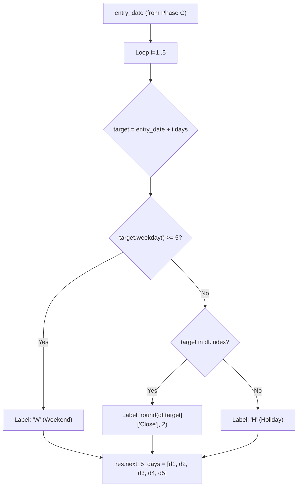

# 003 — Next 5 Calendar Days After Entry

**Priority**: P2
**Status**: Design Complete — Ready for Implementation
**Dependencies**: 001 Entry Mode (entry_date, entry_price infrastructure)

---

## 1. Feature Summary

Add 5 new columns `D+1` through `D+5` in the trade log, placed between **Mode** and **1 Week Return**. Each cell shows the close price if it's a trading day, or a status label if the market was closed.

**Why calendar days, not trading days**: The user wants visibility into exactly which days were trading vs not, including real-time awareness of weekends and holidays.

---

## 2. Data Flow



---

## 3. Visual Treatment

| Cell Content | Meaning | Background | Tooltip |
|---|---|---|---|
| `1250.45` | Trading day — close price | Transparent | `Close: ₹1,250.45` |
| **H** | Holiday (weekday, no data) | Amber `#f59e0b` 15% opacity | `Holiday — Market Closed` |
| **W** | Weekend (Sat/Sun) | Gray `#6b7280` 15% opacity | `Weekend — Market Closed` |

- Prices shown as raw numbers (no ₹ symbol in cell) to keep columns narrow
- ₹ symbol only in tooltip
- Both H and W use bold white text, with distinct background colors

---

## 4. Changes Required

### 4.1 Schema (`backend/models/schemas.py`)

```python
# SignalResult — add this field (order after entry_mode, before return_7d)
next_5_days: Optional[List[Optional[str]]] = None
```

Each element: price string like `"1250.45"`, `"H"`, `"W"`, or `None` (for failed trades).

### 4.2 Backtester (`backend/core/backtester.py`)

After computing `entry_price` (after line ~200) and before `# Calculate forward returns` (line ~214):

```python
# Next 5 calendar days status
next_5 = []
for i in range(1, 6):
    target = entry_date + timedelta(days=i)
    if target.weekday() >= 5:
        next_5.append("W")
    elif target in df.index:
        price = df.loc[target]["Close"]
        next_5.append(str(round(price, 2)))
    else:
        next_5.append("H")
res.next_5_days = next_5
```

### 4.3 Dashboard — Headers (`frontend/src/components/Dashboard.jsx`)

Insert 5 headers after Mode `<th>` and before 1 Week Return `<th>`:

```jsx
<th className="day-header">D+1</th>
<th className="day-header">D+2</th>
<th className="day-header">D+3</th>
<th className="day-header">D+4</th>
<th className="day-header">D+5</th>
```

**Not sortable** — no `onClick`. Only `signal_date` is primary sort.

### 4.4 Dashboard — Row Cells

```jsx
{[(trade.next_5_days || [])[0], (trade.next_5_days || [])[1], ...].map((day, di) => (
    <td key={di} className={`day-cell ${day === 'H' ? 'day-h' : day === 'W' ? 'day-w' : 'day-price'}`}
        title={
            day === 'H' ? 'Holiday — Market Closed' :
            day === 'W' ? 'Weekend — Market Closed' :
            day ? `Close: ₹${day}` : ''
        }
    >
        {day || '-'}
    </td>
))}
```

Compact version using map:

```jsx
{(trade.next_5_days || Array(5).fill(null)).map((day, di) => (
    <td key={di}
        className={`day-cell ${day === 'H' ? 'day-h' : day === 'W' ? 'day-w' : 'day-price'}`}
        title={day === 'H' ? 'Holiday — Market Closed' : day === 'W' ? 'Weekend — Market Closed' : day ? `Close: ₹${day}` : ''}
    >
        {day || '-'}
    </td>
))}
```

### 4.5 Dashboard CSS (`frontend/src/components/Dashboard.css`)

```css
/* ─── Next 5 Days Columns ─── */
.day-header {
    min-width: 55px;
    text-align: center;
    font-size: 0.75rem;
}

.day-cell {
    text-align: center;
    font-size: 0.8rem;
    white-space: nowrap;
    font-variant-numeric: tabular-nums;
    border-radius: 4px;
    min-width: 55px;
}

.day-price {
    color: #e2e8f0;
}

.day-h {
    background: rgba(245, 158, 11, 0.15);
    color: #fef3c7;
    font-weight: 700;
    font-size: 0.75rem;
}

.day-w {
    background: rgba(107, 114, 128, 0.15);
    color: #d1d5db;
    font-weight: 700;
    font-size: 0.75rem;
}
```

---

## 5. Premortem Analysis

### Risk Register

| # | Risk | Severity | Likelihood | Mitigation |
|---|---|---|---|---|
| R1 | **Recent dates → false H** — D+3/D+4/D+5 fall beyond fetch window, labeled "H" even though it's just not fetched | Medium | Medium | Acceptable limitation; document that H means "no data available — could be holiday or beyond fetch range" |
| R2 | **Timezone weekday mismatch** — `.weekday()` on naive datetime may not align with market timezone | Low | Low | Already mitigated by existing `tz_localize(None)` on `df.index` — both sides in same timezone |
| R3 | **Table too wide** — 11 existing + 5 new = 16 columns on a 1400px container | Medium | High | Use horizontal scroll container (already exists); narrow 55px columns; no ₹ prefix in cells |
| R4 | **HD/WE readability** — small colored cells hard to read | Low | Low | Use bold white text + distinct background colors (amber vs gray) |
| R5 | **Sort on D+1..D+5** — string sort mixes prices with H/W nonsensically | Medium | Medium | Headers are NOT click-sortable — removed from sort logic entirely |
| R6 | **Old reports crash** — saved JSON from before this feature has no `next_5_days` | High | Low | Frontend fallback: `trade.next_5_days || Array(5).fill(null)` renders dashes |
| R7 | **Failed trades missing field** — trades with no entry_date have no next_5_days | High | Low | Same fallback as R6; all 5 cells show `-` |
| R8 | **Data gap vs holiday ambiguity** — a yfinance data gap on a weekday looks identical to a holiday | Low | Medium | Acceptable; documented as known limitation |
| R9 | **Schema bloat** — 5 extra string fields per trade × 5000 trades = 25,000 strings | Low | Low | Acceptable — ~200 bytes per trade, negligible |

### Edge Cases

| Case | Behavior | Expected? |
|---|---|---|
| Ticker delisted mid-window | D+3 shows H (no data) | Correct — no data = no trading |
| Entry date is Friday | D+1=Mon(price), D+2=Tue(price), D+3=Wed(price) / W for Sat/Sun | Correct |
| Entry date is Tuesday, Wed is holiday | D+1=Wed(H), D+2=Thu(price) | Correct |
| No entry_date (failed trade) | All 5 cells show `-` | Correct — fallback |
| Old report loaded | All 5 cells show `-` | Correct — fallback |
| Bulk fetch only has 3 days of data | D+1=price, D+2=price, D+3=price, D+4=H, D+5=H | Acceptable — beyond range shows H |

---

## 6. Test Scenarios

1. **Weekend gap**: Upload signals with entry_date on Friday → verify D+1=W, D+2=W, D+3=price
2. **Holiday gap**: Upload with known NSE holiday between entry and D+5 → verify specific day shows H
3. **No gap**: Entry_date on Monday, full week of data → verify all 5 cells show prices
4. **Recent signal**: Entry_date is 2 days before end of fetched data → verify trailing days show H
5. **Failed trade**: Signal with "No Entry Data" → verify all cells show `-`
6. **Old report**: Load saved JSON from before this feature → verify all cells show `-`

---

## 7. Files Changed Summary

| File | Change | Lines |
|---|---|---|
| `backend/models/schemas.py` | +1 field (`next_5_days`) | +1 |
| `backend/core/backtester.py` | +12 lines (loop after entry_price) | +12 |
| `frontend/src/components/Dashboard.jsx` | +5 headers + 5 cells per row | +20 |
| `frontend/src/components/Dashboard.css` | +4 style blocks | +30 |

**Total: ~63 lines across 4 files. Zero changes to existing logic or existing columns.**
