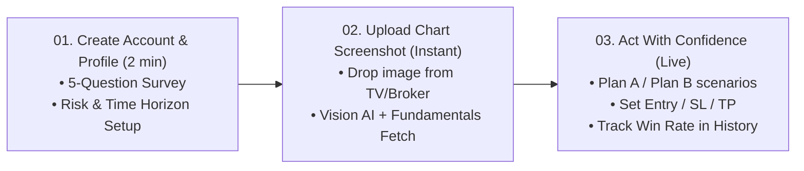
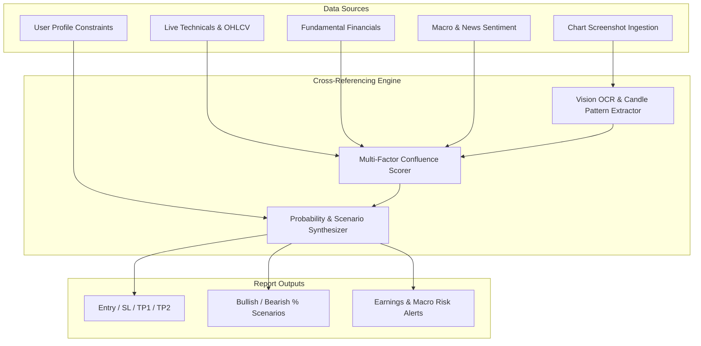

# UpsideGPT Feature Specification & System Architecture Blueprint

> **Target Source:** [UpsideGPT](https://www.upsidegpt.com/)  
> **Purpose:** Detailed teardown of UpsideGPT's features, data pipelines, user workflows, UI architecture, and pricing to replicate and enhance these capabilities within **BacktestBaba**.

---

## 1. Executive Summary & Value Proposition

### 1.1 Product Positioning
* **Core Hook:** *"Pro-level analysis in seconds. Just upload a screenshot."*
* **Target Audience:** Retail stock traders (day traders, swing traders, and part-time investors) tired of second-guessing TradingView charts.
* **Core Differentiator:** While traditional tools only inspect candlestick patterns, UpsideGPT crosses **technical price action** with **fundamental metrics**, **analyst consensus**, and **macro news sentiment** to generate deterministic probability-weighted trade setups.

---

## 2. Core AI Analyzer Outputs & Feature Breakdown

When a user submits a chart screenshot (or selects a ticker), the analyzer produces a comprehensive report structured into modular cards:

```
+-----------------------------------------------------------------------------------+
|  [TICKER HEADER]  Apple Inc. (AAPL · NASDAQ) | $291.13 (-1.66%)                   |
|  [MODE TOGGLE]    [ Short-Term Trading ⚡ ]  [ Long-Term Investing ]             |
|  [ALERT BADGE]    ⚠️ Short / Long Divergence Detected                              |
+-----------------------------------------------------------------------------------+
|  [TRADE SETUP MATRIX]                                                             |
|  Trade Type: SELL LIMIT     | Entry: $294.93        | Stop-Loss: $302.56          |
|  Take Profit 1: $278.76     | Take Profit 2: $259.87| Risk/Reward: 2.12:1         |
+-----------------------------------------------------------------------------------+
|  [TECHNICAL METRICS]                                                              |
|  Trend: 8/10 (Uptrend)      | ADX (14): 35.1 (Strong)| RSI (14): 34.2 (Bearish)   |
|  Confidence: 55% [=====>  ] | ATR (14): $7.59 (Sizes stop & targets)              |
+-----------------------------------------------------------------------------------+
|  [SCENARIOS & PROBABILITIES]                                                      |
|  🟩 Bullish Scenario (30%): Trigger -> Breaks above $303.88 (SMA20)               |
|  🟥 Bearish Scenario (70%): Trigger -> Falls below $285.49 (SMA50) -> Target $270 |
+-----------------------------------------------------------------------------------+
|  [FUNDAMENTALS & EARNINGS LAYER]                                                  |
|  P/E: 34.9 | EPS: $8.33 | ROE: 146.7% | D/E: 0.8                                  |
|  Earnings History: [BEAT +3.1% Apr 30] [BEAT +6.7% Jan 29] | Next: Jul 30, 2026   |
+-----------------------------------------------------------------------------------+
```

### 2.1 Complete Output Specification

| Metric / Output | Example / Format | Purpose / Logic |
| :--- | :--- | :--- |
| **Asset & Ticker Info** | `Apple Inc. (AAPL · NASDAQ)` | Asset identification, industry sector, current price, 24h delta. |
| **Trading Mode Toggle** | `Short-Term Trading ⚡` vs `Long-Term Investing` | Adapts indicators, risk horizons, and triggers based on trader profile. |
| **Signal Call** | `SELL LIMIT` / `BUY LIMIT` / `WAIT` / `ACCUMULATE` | Clear, actionable primary trading recommendation. |
| **Key Entry Level** | `$294.93` | Optimal price point to initiate position based on liquidity & pullbacks. |
| **Stop-Loss Level** | `$302.56` (Red alert) | Volatility-adjusted stop-loss (derived from ATR-14 and key support/resistance). |
| **Take Profit Targets** | `TP1: $278.76` / `TP2: $259.87` (Green) | Multi-target scaled exit strategy based on Fibonacci extensions & S/R zones. |
| **Risk / Reward Ratio** | `2.12:1` | Risk-to-reward calculation `(TP1 - Entry) / (Entry - SL)`. |
| **Trend Score & State** | `8/10 (Uptrend)` | Directional momentum score combined with multi-timeframe moving averages. |
| **ADX (14)** | `35.1 (Strong Trend)` | Evaluates trend strength (>25 = strong trend; <20 = ranging market). |
| **RSI (14)** | `34.2 (Bearish Momentum)` | Relative strength index for overbought/oversold and momentum divergence. |
| **ATR (14)** | `$7.59` | Average True Range used for dynamic stop and target sizing. |
| **Confidence Score** | `55%` (Visual progress bar) | Multi-indicator confluence score across technicals, fundamentals, and volume. |
| **Dual Scenarios & Probabilities** | **Bullish (30%)** vs **Bearish (70%)** | Contingency planning with explicit price triggers (e.g., SMA20 / SMA50 breaks). |
| **Fundamental Layer** | `P/E: 34.9`, `EPS: $8.33`, `ROE: 147%`, `D/E: 0.8` | Cross-checking price momentum against corporate valuation and debt health. |
| **Earnings Catalyst** | Last 2 earnings beats/misses (`+3.1%`, `+6.7%`) & `Next: Jul 30` | Flags binary risk events to prevent entering bad trades right before earnings. |
| **Analyst Consensus** | Price targets, Buy/Hold/Sell analyst distribution | Wall Street sentiment check. |
| **News Sentiment & Macro** | Interest rates, USD Index (DXY), Sentiment score | Macro tailwinds / headwinds (especially critical for Gold / Forex / Tech). |

---

## 3. User Journey & Workflow Steps

UpsideGPT's conversion funnel and user onboarding is structured into **3 core steps**:



### Step 01: Onboarding Questionnaire (Personalized AI Calibration)
* **Time:** ~2 minutes
* **Questions asked during onboarding:**
  1. **Primary asset classes traded** (Stocks, Crypto, Forex, Commodities/Gold).
  2. **Trading timeframe** (Scalping, Day Trading, Swing Trading, Position Investing).
  3. **Technical indicator familiarity** (Price Action only, RSI/MACD, S/R & Fibs, Smart Money Concepts).
  4. **Risk tolerance per trade** (Conservative <1%, Moderate 1-2%, Aggressive >2%).
  5. **Biggest trading pain point** (Entry timing, FOMO, setting stop-loss, holding winners).
* **Outcome:** Calibrates the LLM system prompt for all subsequent analyses.

### Step 02: Instant Chart Ingestion & Processing
* **Action:** Drag-and-drop or paste a screenshot from TradingView, Yahoo Finance, or broker app.
* **Processing Time:** < 5 seconds.
* **Output:** Complete interactive analysis breakdown with bullish/bearish probability bars.

### Step 03: Execution & Trade Journaling
* **Action:** Review Plan A vs Plan B triggers.
* **Tracking:** Analyses are saved to user history to review win rate and setups over time.

---

## 4. Multi-Layer Data Inputs & Cross-Referencing Architecture

UpsideGPT creates an "unfair advantage" by cross-referencing multiple data streams that retail traders rarely inspect simultaneously:



### Layer 1: Multi-Modal Ingestion Engine (TradingView Links, Screenshots & Tickers)
* **Channel A: TradingView Chart Link Ingestion:**
  * Supports direct URL paste: `https://in.tradingview.com/chart/gnW9XoUU/?symbol=NSE%3ASAIL`, `https://www.tradingview.com/chart/?symbol=BSE:TATAMOTORS`, or `https://www.tradingview.com/symbols/NSE-RELIANCE/`.
  * Regex extracts exchange (`NSE`, `BSE`, `NASDAQ`) and ticker symbol (`SAIL`, `TATAMOTORS`, `RELIANCE`).
  * Triggers instant technical confluence engine & fundamental data pipeline.
* **Channel B: Visual / Screenshot Ingestion (Vision AI):**
  * Supported inputs: `.png`, `.jpg`, `.webp` chart screenshots or direct clipboard paste (`Ctrl+V` / `Cmd+V`).
  * Extracted Visual Elements: Ticker symbol, timeframe, price candles, chart patterns (Head & Shoulders, Flags, Double Tops), and visible indicators.
* **Channel C: Direct Backtester Signal Integration:**
  * Directly click "AI Analyze Setup" from any row in the BacktestBaba backtest signal table.

### Layer 2: Technical Indicators & Price Action Engine
* **Support & Resistance:** Key swing highs/lows, order blocks, Fair Value Gaps (FVG).
* **Fibonacci Levels:** 0.382, 0.5, 0.618 golden pocket retracements.
* **Momentum:** RSI(14) divergence, MACD histogram crossovers.
* **Trend Strength:** ADX(14) thresholding (>25 trending, <20 ranging).
* **Volatility Sizing:** ATR(14) for dynamic Stop-Loss (e.g. `1.5 * ATR`) and Target (e.g. `3.0 * ATR`).

### Layer 3: Fundamental & Financial Health Layer
* **Valuation:** P/E Ratio (Trailing & Forward), Price to Sales, EV/EBITDA.
* **Profitability & Growth:** EPS (Earnings Per Share), ROE (Return on Equity), Revenue YoY growth.
* **Solvency:** Debt-to-Equity (D/E), Current Ratio.
* **Event Guardrails:** Last 4 quarterly earnings surprises (% beat/miss) + Countdown to next earnings release.

### Layer 4: Macro & Market Sentiment Layer
* **Analyst Coverage:** Consensus rating (Strong Buy, Buy, Hold, Underperform, Sell) and Average 12-month Price Target.
* **Macro Environment:** Interest rate trends (Fed policy), Dollar Index (DXY), Sector momentum.
* **News Sentiment:** Real-time sentiment score parsed from recent headline feeds.

---

## 5. UI/UX Design System & Layout Blueprint

### 5.1 Visual Style & Color Palette
* **Theme:** Deep Dark Mode (`#0b0c0e` / `#0a0a0b`).
* **Accent Primary:** Electric Emerald (`#1fd96b` / `#34e081`) with soft glow shadows `shadow-[0_10px_34px_-10px_rgba(31,217,107,0.6)]`.
* **Bearish / Alert Accent:** Coral Red (`#f87171` / `#ef4444`).
* **Warning / Divergence Accent:** Amber (`#fbbf24` / `#f59e0b`).
* **Surfaces & Borders:** Glassmorphic translucent cards with subtle white borders `border-white/10` and micro-hover lifts (`hover:-translate-y-1`).

### 5.2 Key Landing Page Sections
1. **Hero Section:**
   * Social proof badge: `Trusted by 800+ active traders · rated 4.5★`
   * Headline: *Pro-level analysis, in seconds. Just upload a screenshot.*
   * High-contrast CTA: "Get started →" with avatar group of satisfied traders.
   * Auto-playing looped demo video in a glowing glass container.
2. **Ticker & Platform Marquee:**
   * Bloomberg, Nasdaq, Reuters, NYSE, CNBC, London Stock Exchange, MarketWatch, S&P Global, Financial Times, Morningstar.
3. **Core Feature Grid (Bento Box Layout):**
   * *Card 1 (2 cols):* Expertise — Trend 8/10, ADX 35.1, RSI 34.2, Support/Resistance/Fibonacci/Smart Money tags.
   * *Card 2 (3 cols):* Fundamental Edge — P/E, EPS, ROE, D/E, Earnings history with +3.1%/+6.7% beats.
   * *Card 3 (3 cols):* Adaptability — Short-Term Trading vs Long-Term Investing indicator tuning.
   * *Card 4 (2 cols):* Probability scenarios — Bullish 30% vs Bearish 70% with trigger levels.
4. **3-Step "How It Works" Section:**
   * Step 01 (2 min): Create account & answer 5 questions.
   * Step 02 (Instant): Upload chart screenshot.
   * Step 03 (Live): Act with confidence & track win rate.
5. **Live Interactive Analysis Demo:**
   * Full simulated trade output for Apple (`AAPL`).
6. **Pricing Matrix:**
   * Side-by-side Monthly ($40) vs Lifetime ($180) cards.
7. **Social Proof & Verified Testimonials:**
   * 800+ traders rating 4.5/5 with verified trade screenshots (e.g. Gold XAU/USD swing setups).
8. **Educational Blog / SEO Guides:**
   * Guides on reading stock charts, candlestick patterns, support/resistance.
9. **FAQ Accordion & Clean Footer.**

---

## 6. Pricing & Monetization Structure

| Plan | Price | Billing Cadence | Key Inclusions | Best For |
| :--- | :--- | :--- | :--- | :--- |
| **Monthly** *(Popular)* | **$40** | Monthly subscription | • Unlimited chart analyses<br/>• Technical + Fundamental + Analyst data<br/>• Buy / Sell / Wait signals with entry, SL & TP<br/>• Bull & bear scenarios with probabilities<br/>• Analysis history & trade journal<br/>• Guides & tutorials<br/>• Cancel anytime | Active traders testing the waters |
| **Lifetime** *(Best Value)* | **$180** | One-time payment | • **Everything in Monthly**<br/>• **Human WhatsApp mentoring / VIP support**<br/>• **Forever access to all future updates**<br/>• Zero recurring subscription fees | Serious long-term traders & investors |

---

## 7. Implementation Plan for BacktestBaba

To build this feature set into BacktestBaba, we can implement the following modules:

### 7.1 Backend Architecture (FastAPI + Multi-modal LLM)
1. **Endpoint: `POST /api/ai/analyze-chart`**
   * Accepts image file (`multipart/form-data`) or `{ symbol, timeframe }`.
   * If image: Uses Gemini / Claude 3.5 Sonnet Vision to extract ticker, timeframe, and visual key levels.
   * Fetches real-time technicals via `yfinance` (`RSI`, `MACD`, `ADX`, `ATR`, `SMA20`, `SMA50`).
   * Fetches fundamentals via `yfinance.Ticker(symbol).info` (`trailingPE`, `eps`, `returnOnEquity`, `debtToEquity`, `calendar`).
   * Calls Structured LLM Output schema to generate JSON response matching `SignalResult` / `TradeSetupReport`.

### 7.2 Frontend Components (React 19 + Tailwind v4 + Recharts)
1. **`AIChartAnalyzerModal.jsx` / `AIChartAnalyzerPage.jsx`**:
   * Drag-and-drop screenshot uploader with clipboard paste (`Cmd+V` / `Ctrl+V`).
   * Multi-view report display (Setup matrix, Indicator gauges, Dual scenario probability bars, Fundamental grid).
2. **`OnboardingSurveyModal.jsx`**:
   * 5-step interactive quiz to persist trader style in `localStorage` / DB user profile.
3. **`TradeJournalHistory.jsx`**:
   * Saves past chart reads with win/loss tracking.

---

## 8. JSON Output Schema Definition

```json
{
  "symbol": "AAPL",
  "name": "Apple Inc.",
  "exchange": "NASDAQ",
  "price": 291.13,
  "change_24h_pct": -1.66,
  "mode": "short_term",
  "divergence_warning": "Short / long divergence detected",
  "trade_setup": {
    "signal": "SELL LIMIT",
    "entry": 294.93,
    "stop_loss": 302.56,
    "take_profit_1": 278.76,
    "take_profit_2": 259.87,
    "risk_reward_ratio": "2.12:1"
  },
  "technicals": {
    "trend_score": 8,
    "trend_direction": "Uptrend",
    "adx_14": { "value": 35.1, "interpretation": "Strong Trend" },
    "rsi_14": { "value": 34.2, "interpretation": "Bearish Momentum" },
    "atr_14": { "value": 7.59, "unit": "USD" },
    "confidence_score_pct": 55
  },
  "scenarios": {
    "bullish": {
      "probability_pct": 30,
      "trigger": "Breaks above $303.88 (SMA20)",
      "target": 315.00
    },
    "bearish": {
      "probability_pct": 70,
      "trigger": "Falls below $285.49 (SMA50)",
      "target": 270.00
    }
  },
  "fundamentals": {
    "pe_ratio": 34.9,
    "eps": 8.33,
    "roe_pct": 146.7,
    "debt_to_equity": 0.8,
    "earnings_history": [
      { "date": "2026-04-30", "outcome": "BEAT", "reaction_pct": 3.1 },
      { "date": "2026-01-29", "outcome": "BEAT", "reaction_pct": 6.7 }
    ],
    "next_earnings_date": "2026-07-30"
  },
  "analyst_sentiment": {
    "consensus": "Moderate Buy",
    "target_mean": 310.00
  }
}
```
