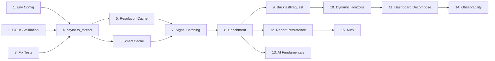

# BacktestBaba — Architectural Evolution Plan

## Phase 1 — Current Architecture Limitations

### 1.1 Concurrency Model: Fundamentally Broken Under Load

The `Backtester.run_backtest_async` is async in name only. Every yfinance call is synchronous `requests.get()` under the hood. With uvicorn's single-event-loop model:

- **1 user running 500 signals** = event loop blocked for ~10-25 minutes
- **2 concurrent users** = second user's WebSocket hangs until first completes
- **Progress callbacks** may batch/delay because the loop can't yield between sync calls

**What breaks first**: WebSocket keepalive. Browser closes connection after ~60s of no pong. The sync-blocked loop can't send pongs → connection drops mid-backtest → user sees nothing.

**Unsafe assumption**: "async def = concurrent". It isn't when calling sync I/O inside.

### 1.2 Data Fetch: O(3n) API Calls Per Backtest

For n signals, the current flow makes:
- n calls to `get_latest_price()` via SymbolResolver (NSE attempt)
- Up to n more calls for BSE fallback
- n calls to `get_ticker_data()` for actual OHLC

**Total**: 2n–3n yfinance HTTP requests, all sequential. Yahoo rate-limits around ~2000/hour. A 700-signal file hits the wall.

**Cache miss amplification**: Cache key is `{symbol}_{start}_{end}`. Signal A for RELIANCE on 2024-01-15 fetches `RELIANCE.NS_2024-01-15_2024-04-25`. Signal B for RELIANCE on 2024-01-20 fetches `RELIANCE.NS_2024-01-20_2024-04-30`. These are **two separate cache entries** for heavily overlapping data.

**Hidden coupling**: SymbolResolver calls DataProvider.get_latest_price which calls yfinance — resolution is entangled with data fetching. A yfinance outage blocks resolution AND data fetch simultaneously.

### 1.3 State & Persistence: Entirely Ephemeral

- **Zero persistence**. Reports exist only in WebSocket response → React state → gone on refresh.
- **No user identity**. Can't save, retrieve, compare, or share reports.
- **DiskCache is the only state** — and it's ticker data with 24h TTL, not reports.

**What breaks**: User runs 30-minute backtest → accidentally refreshes page → all results lost. No recovery possible.

### 1.4 Schema & Domain Model Inconsistencies

| Issue | Detail |
|-------|--------|
| `max_high_90d` naming | Contains max within `duration` param, not 90d. Misleads both developers and consumers. |
| Dead fields | `return_14d`, `return_45d`, `return_60d`, `sector`, `market_cap` defined but never populated |
| `BacktestRequest` | Empty Pydantic model — completely unused |
| Hardcoded horizons | `[7, 30, 90]` baked into backtester logic; schema has more but engine ignores them |
| Frontend hardcoding | Dashboard.jsx references `return_7d`, `return_30d`, `return_90d` as string literals ~40 times |

**Future complexity explosion**: Adding a new timeframe (say 14d) requires changes in: `backtester.py` (horizon list + setattr conditional), `schemas.py` (already there but disconnected), `Dashboard.jsx` (table columns, chart periods, modal logic, stats calculation). Four files, zero shared contract.

### 1.5 Frontend Rendering: Monolith That Can't Scale

`Dashboard.jsx` at 739 lines is a single component containing:
- 7 pieces of local state
- 5 useMemo computations
- 2 embedded sub-components (StockChartModal, Dashboard itself)
- Complete table rendering with sort/search/paginate
- 6 different Recharts chart types
- Modal with 3 chart type variants

**What breaks at scale**: 1000+ trades → all filtered/sorted/paginated in `useMemo` on every render. No virtualization. Sort triggers full array copy + sort + re-render of entire component tree.

### 1.6 API Contract Fragility

No shared type definitions between frontend and backend. The contract is implicit:
- Backend sends `report.dict()` — field names come from Pydantic class attributes
- Frontend destructures with hardcoded string keys
- WebSocket protocol (`type: "progress"|"complete"|"error"`) is undocumented convention

**One Pydantic field rename** silently breaks the entire frontend with no compile-time or test-time error.

### 1.7 Observability: Zero

- No structured logging (only `print()` statements)
- No request tracing
- No metrics (latency, cache hit rate, yfinance failure rate)
- No error tracking (Sentry, etc.)
- No health check endpoint beyond `GET /`

**Operational blindness**: If yfinance starts returning empty DataFrames (happens during Yahoo maintenance), every signal silently gets status "No Data" and the report shows 0% win rate. No alert fires. User thinks the strategy is bad.

---

## Phase 2 — Ideal Target Architecture

### 2.1 Backend Architecture

```
┌─────────────────────────────────────────────────────┐
│                    FastAPI Gateway                    │
│  ┌──────────┐  ┌──────────┐  ┌───────────────────┐  │
│  │ REST API │  │WebSocket │  │  Health/Metrics    │  │
│  └────┬─────┘  └────┬─────┘  └───────────────────┘  │
│       │              │                                │
│  ┌────▼──────────────▼────┐                          │
│  │   Backtest Orchestrator │ ◄── async job manager   │
│  └────────────┬───────────┘                          │
│               │                                      │
│  ┌────────────▼───────────┐                          │
│  │   Worker Pool (async)   │ ◄── asyncio.to_thread   │
│  │  ┌─────┐┌─────┐┌─────┐ │    or process pool      │
│  │  │ W1  ││ W2  ││ W3  │ │                          │
│  │  └──┬──┘└──┬──┘└──┬──┘ │                          │
│  └─────┼──────┼──────┼────┘                          │
│        │      │      │                                │
│  ┌─────▼──────▼──────▼────┐                          │
│  │    Data Access Layer    │                          │
│  │  ┌────────┐ ┌────────┐ │                          │
│  │  │Enricher│ │  Cache  │ │                          │
│  │  │(sector,│ │(smart   │ │                          │
│  │  │mcap)   │ │keying)  │ │                          │
│  │  └───┬────┘ └────┬───┘ │                          │
│  └──────┼───────────┼─────┘                          │
│         │           │                                 │
│    ┌────▼────┐ ┌────▼────┐                           │
│    │yfinance │ │diskcache│                           │
│    └─────────┘ └─────────┘                           │
│                                                      │
│  ┌────────────────────────┐  ┌─────────────────┐    │
│  │  AI Analysis Service   │  │  Report Store    │    │
│  │  (Gemini/Groq)         │  │  (SQLite/JSON)   │    │
│  └────────────────────────┘  └─────────────────┘    │
└─────────────────────────────────────────────────────┘
```

### 2.2 Key Design Decisions

#### A. Parallel Execution via `asyncio.to_thread`

Wrap every yfinance call in `asyncio.to_thread()`. This moves the blocking I/O to a thread pool while keeping the event loop free for WebSocket pongs and progress messages.

```python
# Conceptual — not implementation
df = await asyncio.to_thread(DataProvider.get_ticker_data, symbol, start, end)
```

Additionally, batch signals by symbol — if 5 signals reference RELIANCE at different dates, fetch one wide date range and slice locally.

#### B. Smart Cache with Range Merging

Replace exact-match cache keys with **symbol-level range caching**:
- Key: `{symbol}` → stores `(earliest_date, latest_date, DataFrame)`
- On request: if requested range falls within cached range, slice from cache
- If not: extend the cached range by fetching the delta, merge, re-cache

This eliminates duplicate fetches for overlapping date ranges.

#### C. Symbol Resolution Cache (In-Memory + Disk)

```python
# In-memory dict persisted to diskcache
_resolution_cache: Dict[str, Optional[str]] = {}
# "RELIANCE" → "RELIANCE.NS" (cached for 7 days)
```

Eliminates 2n redundant API calls per backtest.

#### D. Enrichment Layer (sector, market_cap)

After symbol resolution, call `yf.Ticker(symbol).info` once per unique symbol to populate:
- `sector`, `industry`, `market_cap`, `pe_ratio`, `book_value`

Cache for 24h. Attach to every SignalResult for that symbol. This makes `sector` and `market_cap` **actually useful** for filtering/grouping in the Dashboard.

#### E. Dynamic Timeframe System

Replace hardcoded `[7, 30, 90]` with a configurable horizon system:

```python
# User can request any horizons
class BacktestRequest(BaseModel):
    horizons: List[int] = [7, 14, 30, 45, 60, 90]  # Now useful!
    duration: int = 90
```

Schema changes from fixed fields to a dynamic returns dict:

```python
class SignalResult(BaseModel):
    returns: Dict[str, ReturnData]  # {"7d": {return_pct, exit_price, exit_date}, ...}
    max_high: PricePoint  # {price, date}
    max_low: PricePoint   # {price, date}
```

Frontend reads horizons dynamically from the report rather than hardcoded column names.

#### F. AI-Powered Fundamental Analysis

**Provider strategy**: Gemini 2.0 Flash (primary, 1500 req/day free) + Groq Llama 3.3 (fallback).

**Flow**:
1. Backend fetches `yf.Ticker(symbol).info` → structured data (PE, EPS, margins, debt)
2. Formats into a financial context prompt
3. Sends to Gemini/Groq: *"Analyze this Indian equity for a swing trader"*
4. Returns structured verdict: BUY/SELL/HOLD + reasoning + risk factors
5. Frontend renders in FundamentalAnalysis page

**Key constraint**: LLM analyzes data **we provide**, never fabricates financials.

#### G. Report Persistence (SQLite)

```
reports/
  └── backtest.db
      ├── reports (id, created_at, total_signals, summary_json, ...)
      └── trades (id, report_id, symbol, signal_date, returns_json, ...)
```

Enables: report history, comparison, sharing via URL, resume-on-refresh.

#### H. Environment Configuration

```python
# backend/.env
CORS_ORIGINS=http://localhost:5174,https://backtestbaba.vercel.app
CACHE_DIR=.cache
GEMINI_API_KEY=...
GROQ_API_KEY=...
```

```javascript
// frontend — api.js reads from Vite env
const API_URL = import.meta.env.VITE_API_URL || 'http://localhost:8000/api';
const WS_URL = import.meta.env.VITE_WS_URL || 'ws://localhost:8000/ws';
```

---

## Phase 3 — Migration Strategy

> [!IMPORTANT]
> **Core principle**: Every change must leave the app deployable and functional. No big-bang rewrites.

### Migration Waves

```mermaid
gantt
    title Migration Waves
    dateFormat X
    axisFormat %s
    
    section Wave 1: Foundation
    Environment config       :w1a, 0, 1
    Error handling fixes     :w1b, 0, 1
    CORS configuration       :w1c, 0, 1
    Fix broken tests         :w1d, 0, 1
    
    section Wave 2: Performance
    asyncio.to_thread wrap   :w2a, 1, 2
    Symbol resolution cache  :w2b, 1, 2
    Smart cache keys         :w2c, 2, 3
    Signal batching by symbol:w2d, 2, 3
    
    section Wave 3: Domain
    Dynamic horizons backend :w3a, 3, 4
    Enrichment layer         :w3b, 3, 4
    Schema redesign          :w3c, 4, 5
    Dashboard decomposition  :w3d, 4, 6
    
    section Wave 4: Features
    Report persistence       :w4a, 6, 7
    AI fundamentals backend  :w4b, 6, 7
    AI fundamentals frontend :w4c, 7, 8
    
    section Wave 5: Production
    Observability            :w5a, 8, 9
    Auth foundation          :w5b, 8, 9
```



### Wave 1: Foundation (Zero-Risk, Immediate)

**What**: Fix all configuration, error handling, and safety issues without touching business logic.

| Change | Risk | Impact |
|--------|------|--------|
| `api.js` → env vars | NONE | Enables local dev without code changes |
| CORS → env-configured origins list | NONE | Production security |
| CSV parsing → typed exceptions | NONE | Better error messages to user |
| File size validation (10MB cap) | NONE | Prevents memory exhaustion |
| Fix test to call `run_backtest_async` | NONE | Tests pass again |
| Add `.cache/` verification to gitignore | NONE | Already present, verify |

### Wave 2: Performance (Low-Risk, High-Value)

**What**: Fix event loop blocking and eliminate redundant API calls.

**Key change**: Wrap yfinance calls in `asyncio.to_thread()`. This is a **surgical change** — same function signatures, same return values, just non-blocking execution.

**Symbol resolution cache**: Add `@lru_cache` or diskcache lookup before yfinance call in SymbolResolver. Cache hit eliminates 2 API calls per signal.

**Smart cache**: Group signals by symbol, compute widest date range needed, fetch once per symbol instead of once per signal.

### Wave 3: Domain Model (Medium-Risk, Structural)

**What**: Fix the schema, enable dynamic horizons, decompose Dashboard.

This is the most architecturally sensitive wave because it changes the data contract:

1. **Backend**: `SignalResult.returns` becomes `Dict[str, ReturnData]` instead of `return_7d`, `return_30d`, etc.
2. **Enrichment**: `sector`, `market_cap` populated from `yf.Ticker.info`
3. **`BacktestRequest`**: Now carries `horizons: List[int]` from user input
4. **Frontend**: Dashboard reads horizons from report metadata, renders columns dynamically

**Dashboard decomposition target**:
```
Dashboard.jsx (739 lines) →
  ├── SummaryCards.jsx (~60 lines)
  ├── PerformanceCharts.jsx (~120 lines)
  ├── StatisticsTable.jsx (~80 lines)
  ├── TradeLog.jsx (~150 lines)
  ├── StockChartModal.jsx (~200 lines)
  └── DashboardLayout.jsx (~50 lines, orchestrator)
```

### Wave 4: Features (Medium-Risk, New Functionality)

**Report persistence**: SQLite via `peewee` (already in requirements!). Store report JSON + individual trades. Enable report history page.

**AI Fundamentals**:
- New backend service: `core/ai_analyzer.py`
- New endpoint: `GET /api/fundamental/{symbol}`
- Fetches yfinance `.info` → formats context → calls Gemini/Groq → returns analysis
- Frontend: Replaces mock data in `FundamentalAnalysis.jsx` with real API call

### Wave 5: Production Hardening (Low-Risk, Operational)

- Structured logging with `structlog`
- `/health` endpoint with dependency checks
- Request ID tracing
- Error rates and latency metrics
- Auth foundation (JWT-based, can remain optional initially)

---

## Phase 4 — Implementation Sequencing

### Safest Refactoring Order

```
1. api.js env vars          ← touches 1 file, zero logic change
2. main.py CORS/validation  ← touches 1 file, additive only
3. Fix tests                ← touches 1 file, no production impact
4. asyncio.to_thread        ← touches 2 files, same API surface
5. Symbol resolution cache  ← touches 1 file, additive
6. Smart cache keys         ← touches 1 file, backward compatible
7. Signal batching          ← touches backtester.py, internal refactor
8. Enrichment layer         ← new file, additive
9. BacktestRequest usage    ← modify schemas + main.py
10. Dynamic horizons        ← schema change = BREAKING CHANGE
11. Dashboard decomposition ← frontend-only, parallel work
12. Report persistence      ← new files, additive
13. AI fundamentals         ← new files, new endpoint
14. Observability           ← additive middleware
15. Auth foundation         ← additive middleware + new pages
```

> [!WARNING]
> **Step 10 (Dynamic horizons)** is the one true breaking change. It modifies the API response shape. Frontend and backend must be deployed together. All steps before it are backward-compatible.

### Dependency Graph



---

## Phase 5 — Risk & Opportunity Map

### Highest-Risk Modules

| Module | Risk Level | Why |
|--------|-----------|-----|
| `Dashboard.jsx` | 🔴 CRITICAL | 739-line monolith. Any edit risks visual regressions across 6 chart types, modal, table, pagination. No tests. |
| `backtester.py` | 🔴 CRITICAL | Core value of the product. Sync-blocking event loop. Schema coupling. Duration/horizon confusion. |
| `api.js` | 🟡 HIGH | Hardcoded URLs. Dual protocol (WS + REST) with no shared error handling. |
| `data_provider.py` | 🟡 HIGH | Cache key inefficiency. Single point of failure (yfinance). No retry. |

### Easiest Wins (Effort → Impact Ratio)

| Win | Effort | Impact |
|-----|--------|--------|
| Env vars in `api.js` | 5 min | Unblocks all local development |
| `asyncio.to_thread` wrapping | 30 min | Fixes event loop blocking, WebSocket stability |
| Symbol resolution cache | 30 min | Cuts API calls by 40-60% |
| File size validation | 10 min | Prevents server OOM |
| CORS from env | 10 min | Production security |

### Dangerous Refactors (Handle With Care)

| Refactor | Danger | Mitigation |
|----------|--------|------------|
| Schema redesign (fixed fields → dynamic dict) | Breaks every frontend reference | Must be atomic: deploy backend + frontend together. Write adapter layer first. |
| Dashboard decomposition | Visual regressions, lost CSS specificity | Screenshot-test before/after. Decompose one section at a time. |
| Cache key restructuring | Existing cache becomes invalid | Clear cache on deploy. Add cache version prefix. |

### Architectural Trap Zones

1. **"Just add more horizons"** — Without dynamic schema, every new horizon is 4-file change. Fix the schema FIRST.

2. **"Make backtester faster with multiprocessing"** — ProcessPoolExecutor can't serialize DataFrames through pickle cleanly. Use `asyncio.to_thread` (thread pool), not process pool.

3. **"Add a database for everything"** — SQLite is sufficient for single-instance deployment. Don't introduce PostgreSQL/Redis complexity until there's multi-instance need.

4. **"Real auth now"** — Auth is a rabbit hole (password hashing, token refresh, email verification, password reset). The localStorage mock is fine for the current stage. Plan for it architecturally (middleware slot) but don't build it until features stabilize.

5. **"AI on every stock"** — LLM API rate limits (Gemini: 15 RPM free) mean you can't analyze 500 stocks in a backtest. AI analysis should be on-demand per stock, not batch.

### My Additional Recommendations (Beyond Your Comments)

1. **WebSocket heartbeat**: Add ping/pong keepalive every 30s to prevent browser timeout during long backtests.

2. **Backtest cancellation**: User should be able to abort a running backtest. Currently impossible — no cancellation token.

3. **CSV column auto-detection**: Current code checks `symbol/Symbol` and `date/Date`. ChartInk exports use different column names. Add fuzzy column matching.

4. **Batch yfinance fetching**: `yf.download(["RELIANCE.NS", "TCS.NS", ...])` fetches multiple tickers in one HTTP call. Massive speedup for the data fetch phase.

5. **Export to CSV/Excel**: User can currently only save JSON. Add CSV/Excel export of the trade log.

6. **SEO & HTML meta**: `index.html` has `<title>frontend</title>` — should be `BacktestBaba | Stock Screener Backtester Pro`.

7. **Error boundary in React**: One chart crash kills the entire app. Add `<ErrorBoundary>` around Dashboard.

8. **`App.css` is Vite boilerplate**: Still has the default Vite logo-spin CSS. Should be cleaned up.

---

## Open Questions for Your Decision

> [!IMPORTANT]
> These decisions affect the architecture direction. Please weigh in before I proceed.

1. **Timeframe selection**: Should users pick custom horizons per backtest (e.g., "I want 5d, 15d, 45d"), or should we offer preset packs (Quick: 7/30, Standard: 7/30/90, Deep: 7/14/30/45/60/90)?

2. **AI provider priority**: Gemini (more generous free tier, 1500/day) vs Groq (faster, but stricter limits). Which should be primary? Or should user choose in settings?

3. **Report persistence scope**: Store only summary + metadata, or full trade-level detail? Full detail enables re-rendering without re-running but uses more storage.

4. **Deployment model**: Stay with Render free tier (cold starts, 15min sleep) or plan for Railway/Fly.io/self-hosted? This affects whether we add background job infrastructure.

5. **Should the Dashboard decomposition happen before or after the dynamic horizons schema change?** Doing it before means decomposing with the old schema then adapting. Doing it after means one big change wave but less total work.
