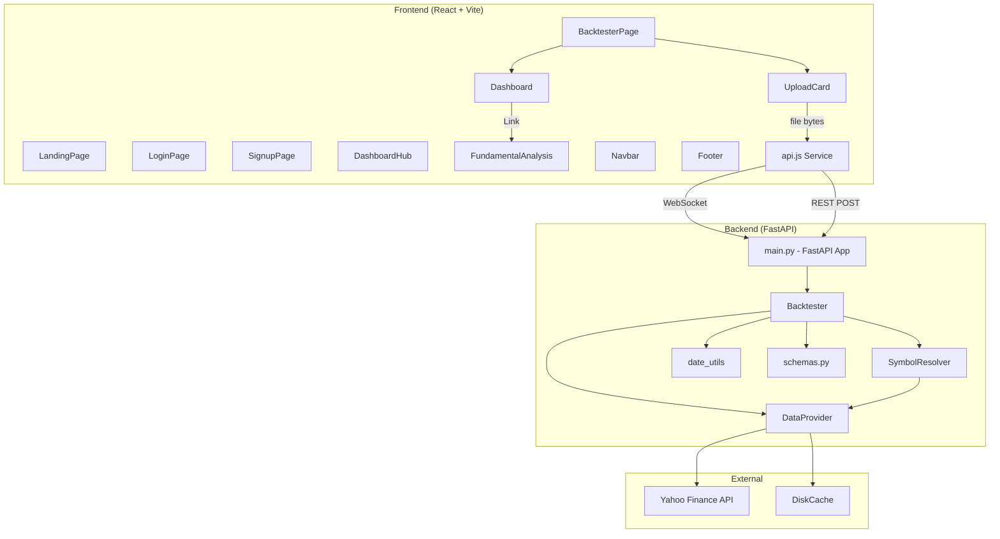
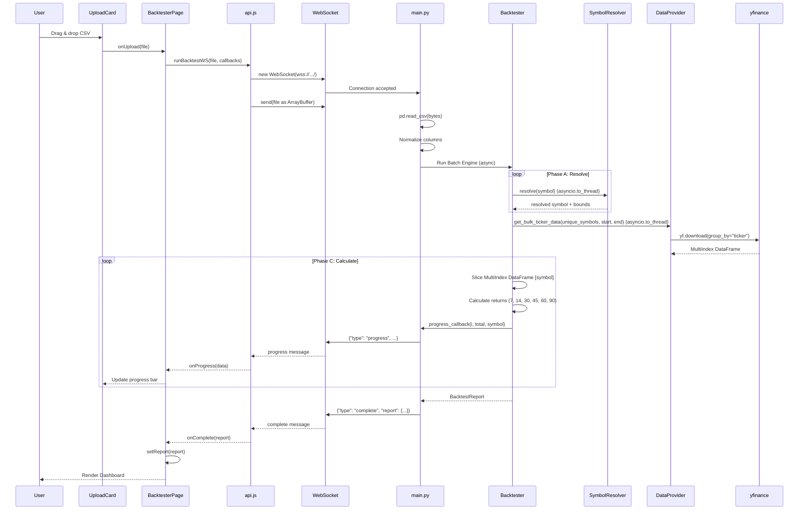

# BacktestBaba — Repository Immersion Analysis

## Phase 1 — Repository Mental Model

### What This System Fundamentally Is

BacktestBaba (marketed as "Stock Screener Backtester Pro") is a **full-stack trading signal backtesting platform** targeting Indian equity markets. It answers one core question:

> *"If I had acted on these stock screening signals on the dates they were generated, how would I have performed over 7, 30, and 90 days?"*

The system accepts a CSV/Excel file containing `(symbol, date)` pairs — typically exported from stock screeners like [ChartInk](https://chartink.com/) — and computes forward-looking returns by fetching historical price data from Yahoo Finance via `yfinance`.

### How It Behaves

1. **User uploads a file** of signals (symbol + date pairs)
2. **Backend resolves each symbol** to its NSE (.NS) or BSE (.BO) Yahoo Finance ticker
3. **Backend fetches historical OHLC data** from yfinance with disk caching
4. **For each signal**, it calculates 7d/30d/90d forward returns, max high, max low
5. **Aggregates** into a comprehensive report with win rates, averages, best/worst performers
6. **Frontend renders** interactive charts, statistics tables, trade logs, and per-stock detail modals
7. **Real-time progress** is streamed via WebSocket during processing

### Architectural Style

- **Client-Server monorepo** with clear frontend/backend separation
- **Backend**: Python FastAPI — request-response + WebSocket hybrid
- **Frontend**: React 18 SPA with Vite + TailwindCSS v4 + vanilla CSS
- **Communication**: Dual-path — WebSocket (primary, with progress) + REST (fallback)
- **Data layer**: Stateless computation backed by yfinance + diskcache (no persistent database)
- **Auth**: Mock/localStorage-only (no real authentication system)
- **Deployment**: Split topology — Render (backend) + Vercel (frontend)

---

## Phase 2 — Architecture Map

### Subsystem Diagram



### Subsystem Responsibilities

---

#### Backend: `main.py` — API Gateway & Orchestrator
- **Purpose**: Single entry point exposing two endpoints — WebSocket `/ws/backtest` and REST `POST /api/backtest`
- **Dependencies**: FastAPI, pandas, Backtester, BacktestReport schema
- **State ownership**: None. Stateless request handler.
- **Upstream**: Frontend (WebSocket or HTTP)
- **Downstream**: Backtester engine
- **Risks**: 
  - Bare `except:` in CSV parsing (line 35) silently swallows errors
  - CORS set to `allow_origins=["*"]` — acceptable for dev, dangerous in prod
  - No input validation on file size or content
  - WebSocket has no authentication or rate limiting

---

#### Backend: `core/backtester.py` — Core Engine
- **Purpose**: The computational heart. Iterates over signals, resolves symbols, batch-fetches data, calculates returns.
- **Dependencies**: DataProvider, SymbolResolver, date_utils, schemas
- **State ownership**: None (pure function wrapped in static method)
- **Key invariants**:
  - Duration capped at 7–180 days (line 16)
  - Horizons are always `[7, 14, 30, 45, 60, 90]` plus the custom duration
  - Fully populates schema fields for all 6 horizons.
  - `max_high_90d` / `max_low_90d` actually represent max high/low within the `duration` window
- **Scaling behavior**: O(1) bulk fetch per 100 symbols via `yfinance`. Uses a deterministic 3-Phase approach (Resolve -> Batch Fetch -> Slice MultiIndex) to drastically reduce network overhead.
- **Resilience**: Features an automatic fallback path to sequential `asyncio.to_thread` fetches if `yfinance` drops a ticker during a batch download.

---

#### Backend: `core/data_provider.py` — Data Access Layer
- **Purpose**: Wrapper around yfinance providing both bulk `yf.download` and sequential `yf.Ticker` fetching, with diskcache caching for the sequential fallback path.
- **Dependencies**: yfinance, diskcache
- **Cache strategy**: Sequential fallback uses Key = `{symbol}_{start}_{end}`, TTL = 24h. Bulk fetching is intentionally uncached due to highly variable date bounds per CSV upload.
- **Cache location**: `.cache/` directory relative to backend root

---

#### Backend: `core/symbol_resolver.py` — Symbol Resolution
- **Purpose**: Converts bare stock symbols (e.g., "RELIANCE") to Yahoo Finance tickers ("RELIANCE.NS")
- **Strategy**: Try `.NS` first (NSE), then `.BO` (BSE)
- **Dependencies**: DataProvider (for existence checking)
- **Optimization**: Uses an in-memory `_cache` dictionary to prevent duplicate network lookups for symbols repeating within the same backtest run. All network calls are wrapped in `asyncio.to_thread` to prevent event loop starvation.

---

#### Backend: `utils/date_utils.py` — Date Handling
- **Purpose**: Date parsing (7 formats) and next-trading-day lookup
- **Key behavior**: `get_next_trading_day` does a forward scan of up to 5 days in the data index to find the nearest available trading day
- **Hidden assumption**: Relies on data availability in the DataFrame to determine trading days — no calendar of NSE/BSE holidays

---

#### Backend: `models/schemas.py` — Data Models
- **Purpose**: Pydantic models defining the API contract
- **Key models**:
  - `SignalResult`: Per-signal output with returns at 7d/14d/30d/45d/60d/90d, max high/low
  - `BacktestReport`: Aggregate report with win rates, averages, best/worst performers, trade list
- **Dead fields**: `sector` and `market_cap` on SignalResult are currently empty placeholders (reserved for Phase 2.3).

---

#### Frontend: `services/api.js` — API Client
- **Purpose**: Dual communication layer — WebSocket (primary) and REST (fallback)
- **Critical observation**: API URLs are **hardcoded** to production Render URLs:
  ```javascript
  const API_URL = 'https://backtestbaba-api.onrender.com/api';
  const WS_URL = 'wss://backtestbaba-api.onrender.com/ws';
  ```
  There is NO environment variable usage despite the deployment docs recommending `VITE_API_URL`.
- **WebSocket protocol**: Sends raw file bytes → receives progress JSON messages → receives completion JSON

---

#### Frontend: `pages/BacktesterPage.jsx` — Main Workflow Orchestrator
- **Purpose**: Manages the upload → progress → results lifecycle
- **State**: `report`, `isLoading`, `progress`, `error`
- **Key behavior**: Dynamic import of api.js (`import('../services/api')`) — probably unnecessary overhead for a module that's always used

---

#### Frontend: `components/Dashboard.jsx` — Results Visualization (739 lines)
- **Purpose**: The **largest and most complex component** — renders the entire backtest results view
- **Contains**: Summary cards, bar charts (per period), pie chart (best period distribution), statistics table, trade log with pagination/search/sort, stock detail modal
- **State**: search term, sort config, pagination, capital amount, selected stock/period for modal
- **Embedded sub-component**: `StockChartModal` — renders Area/Line/Bar charts for individual stock performance
- **Key dependency**: Recharts library for all charting
- **Fragility**: Monolithic component with no decomposition. Any change risks breaking the entire results view.

---

#### Frontend: Auth Pages (`LoginPage.jsx`, `SignupPage.jsx`)
- **Purpose**: Mock authentication — no real API calls
- **Behavior**: `setTimeout(() => { localStorage.setItem('isLoggedIn', 'true') }, 1500)` — simulates a 1.5s API call
- **ProtectedRoute** in `App.jsx` checks `localStorage.getItem('isLoggedIn')`
- **Security**: ZERO. Anyone can bypass by setting `localStorage.isLoggedIn = 'true'` in console.

---

#### Frontend: `pages/FundamentalAnalysis.jsx`
- **Purpose**: Placeholder page with **100% mock data** (hardcoded Reliance Industries data)
- **Status**: Non-functional. No backend endpoint exists for fundamentals.

---

#### Frontend: `pages/DashboardHub.jsx`
- **Purpose**: Tool selection page with 3 cards (Backtester active, Fundamental and Screener locked)
- **State**: Static — no data fetching

---

### Dependency Direction

```
Frontend → api.js → [WebSocket/HTTP] → main.py → Backtester → DataProvider → yfinance
                                                            → SymbolResolver → DataProvider
                                                            → date_utils
                                                            → schemas
```

Dependency flow is clean and unidirectional. No circular dependencies.

---

## Phase 3 — Execution Flow

### Primary Flow: Backtest via WebSocket



### State Transitions

```
IDLE → FILE_SELECTED → UPLOADING → PROCESSING (progress updates) → COMPLETE → DASHBOARD_VIEW
                                  ↘ ERROR
```

### Async Boundaries

1. **WebSocket connection** — async I/O between frontend and backend.
2. **`run_backtest_async`** — fully non-blocking.
3. **yfinance calls** — synchronous I/O, but safely wrapped in `asyncio.to_thread` to prevent event loop starvation.

> [!TIP]
> The `Backtester.run_backtest_async` method delegates all blocking HTTP requests (Yahoo Finance) to separate threads via `asyncio.to_thread`. This keeps the main FastAPI event loop completely free to pump WebSocket progress messages back to the frontend without stalling.

### Configuration Flow

| Config | Source | Current Value |
|--------|--------|---------------|
| API/WS URL | Vite `.env` / `api.js` | Uses `import.meta.env` with fallback |
| CORS | Backend `.env` | `CORS_ORIGINS` parsed via `main.py` |
| Cache dir | `data_provider.py` | `backend/.cache/` |
| Cache TTL | `data_provider.py` | 86400s (historical), 7-days (metadata) |
| Duration | `backtester.py` | 90 days default, 7-180 range |
| Auth | localStorage | Mock — no real auth |

---

## Phase 4 — Risk Analysis

### 🔴 Critical Risks

| Risk | Location | Impact | Likelihood |
|------|----------|--------|------------|
| **No auth** | `LoginPage.jsx`, `App.jsx` | Any user can bypass auth via console | CERTAIN |
| **Monolithic Component** | `Dashboard.jsx` | 700+ lines makes UI edits highly prone to regressions | HIGH |
| **Hardcoded prod URLs** | `api.js` | Local dev impossible without code change | CERTAIN |
| **No input validation** | `main.py` | Arbitrary file upload, memory exhaustion with large files | HIGH |
| **yfinance rate limiting** | `data_provider.py`, `symbol_resolver.py` | Bulk operations trigger Yahoo Finance blocks | HIGH |

### 🟡 Moderate Risks

| Risk | Location | Impact |
|------|----------|--------|
| **Schema drift** | `schemas.py` vs `backtester.py` | 14d/45d/60d fields never populated — frontend would show N/A |
| **Field naming lies** | `backtester.py` L119-120 | `max_high_90d` contains max within `duration` period, not 90d specifically |
| **Monolithic Dashboard** | `Dashboard.jsx` (739 lines) | Any change risks breaking the entire results view |
| **No error boundaries** | All frontend pages | Uncaught exception crashes entire app |
| **Cache key specificity** | `data_provider.py` | Same symbol with overlapping date ranges stored separately — cache miss when date ranges differ by even 1 day |
| **Test coverage** | `test_backtester.py` | Tests reference `run_backtest` (sync) but actual code only has `run_backtest_async` — **tests are broken** |

### 🟢 Low Risks (Technical Debt)

| Item | Location | Notes |
|------|----------|-------|
| TailwindCSS v4 + vanilla CSS hybrid | `index.css`, `Dashboard.css` | Two styling paradigms coexist |
| Unused schema fields | `schemas.py` | `BacktestRequest`, `sector`, `market_cap` — dead code |
| FundamentalAnalysis page | `FundamentalAnalysis.jsx` | 100% mock data, no backend |
| Dynamic import in BacktesterPage | `BacktesterPage.jsx` L19 | `import('../services/api')` — unnecessary code splitting |
| `postcss.config.js` references | Frontend root | PostCSS configured but TailwindCSS v4 uses `@import "tailwindcss"` syntax |

### Hidden Coupling

1. **SymbolResolver ↔ DataProvider**: Resolution uses `get_latest_price` which is a data-fetching method — conceptually leaky. Symbol resolution shouldn't need to fetch actual price data.
2. **Dashboard.jsx ↔ Schema fields**: Dashboard directly references `return_7d`, `return_30d`, `return_90d`, `max_high_90d`, `max_low_90d` by name — any schema rename breaks the frontend silently.
3. **WebSocket message format**: No schema/contract — both sides assume `{"type": "progress"|"complete"|"error"}` structure. Breaking change requires coordinated deploy.

### Scaling Characteristics

| Dimension | Behavior |
|-----------|----------|
| **Users** | No concurrency isolation. Multiple users on WebSocket would serialize through the same event loop. |
| **Signal count** | Linear. 1000 signals = 1000 sequential yfinance calls ≈ 15-30 minutes |
| **yfinance API** | No parallelism, no batching, no rate limiting. Bulk runs will be throttled by Yahoo. |
| **Cache** | DiskCache scales well for reads but cache misses are expensive (1-3s per yfinance call) |
| **Frontend** | Dashboard re-renders are O(n) in trades count. 1000+ trades with complex charting may lag |

---

## Phase 5 — Maintainer Guidance

### How to Think About This System

1. **It's a data pipeline with a UI**, not a traditional web app. The core value is in `backtester.py` — everything else is plumbing and presentation.

2. **The frontend is presentation-heavy but logic-light**. Dashboard.jsx has complex visualization logic but no business logic. All computation happens server-side.

3. **Authentication is theatrical**. The login/signup flow exists purely for UX — there is no user data, no sessions, no authorization. Treat all routes as public.

4. **The system has two deployment personalities**: Local dev (needs code changes to `api.js`) and production (Render + Vercel). There is no proper environment configuration bridge.

### What Not to Break

1. **WebSocket message protocol** — Both frontend `api.js` and backend `main.py` must agree on `{"type": "progress|complete|error"}`. Any change needs coordinated deployment.

2. **Schema field names** — `return_7d`, `return_30d`, `return_90d`, `max_high_90d`, `max_low_90d`, `signal_date`, `entry_price`, `exit_price_Xd` are hardcoded throughout Dashboard.jsx. Renaming any of these without updating the frontend will cause silent data display failures (showing "N/A" everywhere).

3. **`Backtester.run_backtest_async` signature** — Called from both WebSocket and REST handlers with different callback configurations.

4. **TailwindCSS v4 import syntax** — `@import "tailwindcss"` and `@config` in `index.css` are TailwindCSS v4 specific. Downgrading TailwindCSS will break all utility classes.

### Where Future Complexity Will Emerge

1. **Real authentication** — Adding actual user accounts, sessions, API keys will touch: `main.py` (middleware), `App.jsx` (routing), `Navbar.jsx` (state), and create new backend models/services. The localStorage approach will need to be completely replaced.

2. **Multiple timeframe support** — The schema has 14d/45d/60d fields already defined but the backtester only computes 7d/30d/90d. Enabling these requires changes in `backtester.py` (line 110 conditional), `Dashboard.jsx` (table columns), and `StockChartModal` (period handling).

3. **Real fundamental analysis** — The `FundamentalAnalysis.jsx` page is pure mock. Building it out requires a new backend endpoint, yfinance `.info` data fetching, and significant frontend work.

4. **Concurrent backtest processing** — Moving from sequential to parallel yfinance fetching (using `asyncio.to_thread` or `aiohttp`) will significantly improve performance but requires careful rate limiting to avoid Yahoo Finance blocks.

5. **Report persistence** — Currently, reports exist only in memory/frontend state. Saving and retrieving past reports requires a database (SQLite, PostgreSQL) and user identity.

### Coding Conventions Observed

| Convention | Details |
|------------|---------|
| **Python** | Static methods on classes, no dependency injection, relative imports |
| **React** | Functional components with hooks, no context/state management library |
| **Styling** | Hybrid: TailwindCSS v4 for pages + vanilla CSS for heavy components (Dashboard, UploadCard) |
| **File naming** | PascalCase for React components, snake_case for Python modules |
| **Import style** | Named imports from lucide-react, default imports for pages/components |
| **Animation** | Framer Motion for transitions, CSS keyframes for continuous animations |

### Immediate Actionable Fixes (Zero-Risk)

1. **Fix broken tests**: `test_backtester.py` calls `Backtester.run_backtest` which doesn't exist — it's `run_backtest_async`
2. **Environment variable for API URL**: Replace hardcoded URLs in `api.js` with `import.meta.env.VITE_API_URL`
3. **Remove dead schema fields**: `BacktestRequest`, `return_14d`, `return_45d`, `return_60d`, `sector`, `market_cap`
4. **Add `.cache/` to `.gitignore`** if not already present
